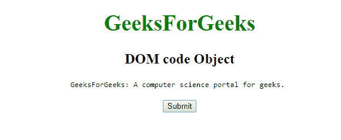
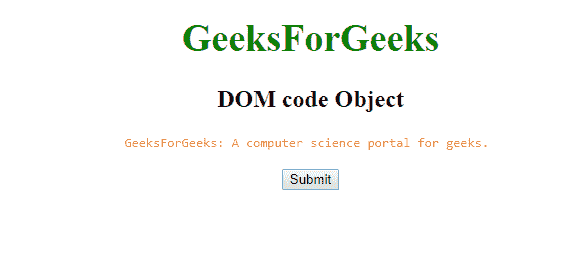
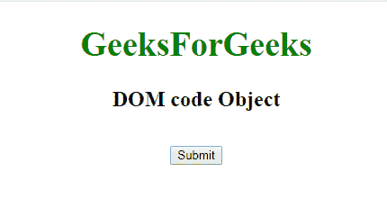
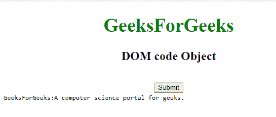

# HTML | DOM 代码对象

> 原文:[https://www.geeksforgeeks.org/html-dom-code-object/](https://www.geeksforgeeks.org/html-dom-code-object/)

**DOM 代码对象**用于表示 [HTML <代码>元素](https://www.geeksforgeeks.org/html-code-tag/)。代码元素由 **getElementById()** 访问。
**语法:**

```html
document.getElementById("id"); 
```

其中‘id’是分配给**代码**标签的 ID。
**例-1:**

## 超文本标记语言

```html
<!DOCTYPE html>
<html>

<body>
    <center>
        <h1 style = "color:green; font-size:38px;">
          GeeksForGeeks
        </h1>
        <h2>DOM code Object</h2>

        <!-- Assign id to CODE tag-->
        <code id="GFG">
          GeeksForGeeks: A computer science portal for geeks.
        </code>

        <br>
        <br>
        <button onclick="myGeeks()">Submit</button>

        <script>
            function myGeeks() {
                var g = document.getElementById("GFG");

                <!--Change the color of code element.-->
                g.style.color = "coral";
            }
        </script>

</body>

</html>
```

**输出:**
**点击按钮前:**



**点击按钮后:**



**示例-2:** 可以使用 **document.createElement** 方法创建代码对象。

## 超文本标记语言

```html
<!DOCTYPE html>
<html>

<body>
    <center>
        <h1 style = "color:green; font-size:38px;" >
          GeeksForGeeks
        </h1>
        <h2>DOM code Object</h2>
        <br>

        <button onclick="myGeeks()">Submit</button>

        <script>
            <!--Creating code element-->
            function myGeeks() {
                var g = document.createElement("CODE");
                var f =
                document.createTextNode("GeeksForGeeks:"
                +"A computer science portal for geeks.");

                g.appendChild(f);

                document.body.appendChild(g);
            }
        </script>
</body>

</html>
```

**输出:**
**点击按钮前:**



**点击按钮后:**



**支持的浏览器:****DOM 代码对象**支持的浏览器如下:

*   谷歌 Chrome
*   微软公司出品的 web 浏览器
*   火狐浏览器
*   歌剧
*   旅行队