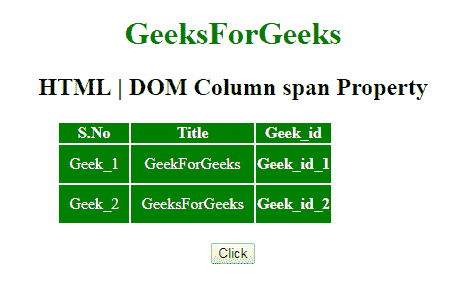
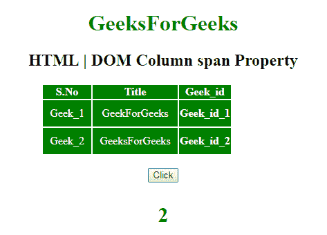
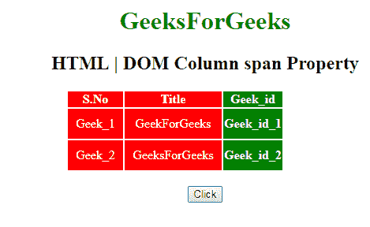

# HTML | DOM 列跨度属性

> 原文:[https://www . geesforgeks . org/html-DOM-column-span-property/](https://www.geeksforgeeks.org/html-dom-column-span-property/)

**DOM 列跨度属性**用于**设置**或**返回 **<列>** 元素跨度属性的值。HTML 中的 colspan 属性指定单元格应该跨越的列数。**

**语法:**

*   它用于返回 span 属性。

    ```html
    columnObject.span
    ```

*   It is used to set the formMethod property.

    ```html
    columnObject.span = number
    ```

    **属性值:**

    *   **数字:**指定单元格应该跨越的列数。它不允许负值。

    **返回值:**返回一个代表列数的数值。

    **示例-1:** 该示例说明如何返回列跨度属性。

    ```html
    <!DOCTYPE html>
    <html>

    <head>
        <title>
            HTML | DOM Column span Property
        </title>
    </head>
    <style>
        #myCol {
            background: green;
        }

        table {
            color: white;
            margin-left: 150px;
        }

        #Geek_p {
            color: green;
            font-size: 30px;
        }

        td {
            padding: 10px;
        }
    </style>

    <body style="text-align:center;">

        <h1 style="color:green;"> 
                GeeksForGeeks 
            </h1>

        <h2>HTML | DOM Column span Property</h2>
        <table>
            <colgroup>
              <col id="myCol" span="2">
                <col style="background-color:green">
            </colgroup>
            <tr>
                <th>S.No</th>
                <th>Title</th>
                <th>Geek_id</th>
            </tr>
            <tr>
                <td>Geek_1</td>
                <td>GeekForGeeks</td>
                <th>Geek_id_1</th>
            </tr>
            <tr>
                <td>Geek_2</td>
                <td>GeeksForGeeks</td>
                <th>Geek_id_2</th>
            </tr>
        </table>
        <br>
        <button onclick="myGeeks()">
            Click
        </button>
        <h4> 
                <p id="Geek_p"
                   style="color:green">
          </p> 
            </h4>
        <script>
            function myGeeks() {
                // access col element 
                var x = document.getElementById(
                    "myCol").span;
                document.getElementById(
                    "Geek_p").innerHTML = x;
            }
        </script>
    </body>

    </html>
    ```

    **输出:**

    **点击按钮前:**
    

    **点击进入按钮后:**
    

    **示例-2:** 这个 HTML 示例说明了如何设置列跨度属性。

    ```html
    <!DOCTYPE html>
    <html>

    <head>
        <title>
            HTML | DOM Column span Property
        </title>
    </head>
    <style>
        #gfg {
            background: green;
        }

        table {
            color: white;
            margin-left: 150px;
        }

        #Geek_p {
            color: green;
            font-size: 30px;
        }

        td {
            padding: 10px;
        }
    </style>

    <body style="text-align:center;">

        <h1 style="color:green;"> 
                GeeksForGeeks 
            </h1>

        <h2>HTML | DOM Column span Property</h2>
        <table>
            <colgroup>
              <col id="gfg" span="3">
                <col style=
                   "background-color:green">
            </colgroup>
            <tr>
                <th>S.No</th>
                <th>Title</th>
                <th>Geek_id</th>
            </tr>
            <tr>
                <td>Geek_1</td>
                <td>GeekForGeeks</td>
                <th>Geek_id_1</th>
            </tr>
            <tr>
                <td>Geek_2</td>
                <td>GeeksForGeeks</td>
                <th>Geek_id_2</th>
            </tr>
        </table>
        <br>
        <button onclick="myGeeks()">
            Click
        </button>
        <h4> 
                <p id="Geek_p" 
                   style="color:green">
          </p> 
            </h4>
        <script>
            function myGeeks() {
                // access col element 
                document.getElementById(
                    "gfg").span = 2;
                document.getElementById("gfg").
                style.backgroundColor = "red";

            }
        </script>
    </body>

    </html>
    ```

    **输出:**
    **点击按钮前:**
    

    **点击按钮后:**
    

    **支持的浏览器:****DOM 列跨度属性**支持的浏览器如下:

    *   谷歌 Chrome
    *   微软公司出品的 web 浏览器
    *   火狐浏览器
    *   歌剧
    *   旅行队