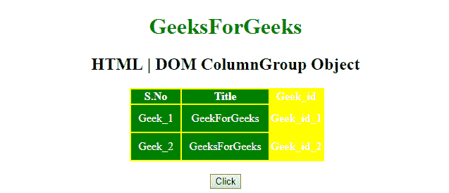
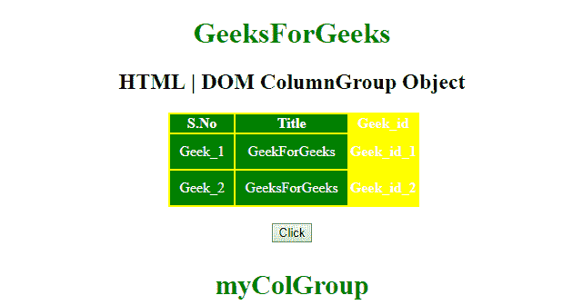
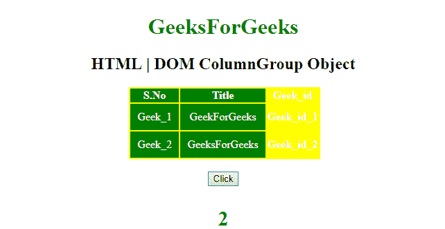

# HTML | DOM 列组对象

> 原文:[https://www.geeksforgeeks.org/html-dom-columngroup-object/](https://www.geeksforgeeks.org/html-dom-columngroup-object/)

HTML DOM 中的**列组对象**用来表示 HTML [<列组>](https://www.geeksforgeeks.org/html-colgroup-tag/) 元素。
此标签用于**设置**或**获取 **< colgroup >** 元素的属性。可以使用 **getElementById()** 方法访问。
**语法:**** 

```html
document.getElementById("ColGroup_ID");
```

这个 ColGroup_ID 被分配给 HTML < colgroup >元素。
**房产价值:**

*   [**span:**](https://www.geeksforgeeks.org/html-dom-columngroup-span-property/?ref=rp) 用于设置或返回 span 属性的值。

**示例-1:** 使用**文档返回**“列组标识”**。id；**

## 超文本标记语言

```html
<!DOCTYPE html>
<html>

<head>
    <title>
        HTML | DOM ColumnGroup Object
    </title>
</head>
<style>
    #myColGroup {
        background: green;
    }

    table {
        color: white;
        margin-left: 180px;
        background: yellow;
    }

    #Geek_p {
        color: green;
        font-size: 30px;
    }

    td {
        padding: 10px;
    }
</style>

<body style="text-align:center;">

    <h1 style="color:green;"> 
            GeeksForGeeks 
        </h1>

    <h2>HTML | DOM ColumnGroup Object</h2>
    <table>
        <colgroup id="myColGroup" span="2">
        </colgroup>
        <tr>
            <th>S.No</th>
            <th>Title</th>
            <th>Geek_id</th>
        </tr>
        <tr>
            <td>Geek_1</td>
            <td>GeekForGeeks</td>
            <th>Geek_id_1</th>
        </tr>
        <tr>
            <td>Geek_2</td>
            <td>GeeksForGeeks</td>
            <th>Geek_id_2</th>
        </tr>
    </table>
    <br>
    <button onclick="myGeeks()">
        Click
    </button>
    <h4>
            <p id="Geek_p" style="color:green"></p>

        </h4>
    <script>
        function myGeeks() {
            // access ColumnGroup element
            var x = document.getElementById("myColGroup").id;
            document.getElementById("Geek_p").innerHTML = x;
        }
    </script>
</body>

</html>
```

**输出:**

*   **点击按钮前:**



*   **点击按钮后:**



**示例-2:** 使用**文档. getElementById(“我的组”)从**“组标识”**返回跨度元素的编号。跨度；**

## 超文本标记语言

```html
<!DOCTYPE html>
<html>

<head>
    <title>
        HTML | DOM ColumnGroup Object
    </title>
</head>
<style>
    #myColGroup {
        background: green;
    }

    table {
        color: white;
        margin-left: 180px;
        background: yellow;
    }

    #Geek_p {
        color: green;
        font-size: 30px;
    }

    td {
        padding: 10px;
    }
</style>

<body style="text-align:center;">

    <h1 style="color:green;"> 
            GeeksForGeeks 
        </h1>

    <h2>HTML | DOM ColumnGroup Object</h2>
    <table>
        <colgroup id="myColGroup" span="2">
        </colgroup>
        <tr>
            <th>S.No</th>
            <th>Title</th>
            <th>Geek_id</th>
        </tr>
        <tr>
            <td>Geek_1</td>
            <td>GeekForGeeks</td>
            <th>Geek_id_1</th>
        </tr>
        <tr>
            <td>Geek_2</td>
            <td>GeeksForGeeks</td>
            <th>Geek_id_2</th>
        </tr>
    </table>
    <br>
    <button onclick="myGeeks()">
        Click
    </button>
    <h4>
            <p id="Geek_p" style="color:green"></p>

        </h4>
    <script>
        function myGeeks() {
            // access ColumnGroup element
            var x = document.getElementById("myColGroup").span;
            document.getElementById("Geek_p").innerHTML = x;
        }
    </script>
</body>

</html>
```

**输出**T2】

*   **点击按钮前:**


*   **点击按钮后:**



**支持的浏览器:**

*   谷歌 Chrome
*   Mozilla Firefox
*   边缘
*   旅行队
*   歌剧