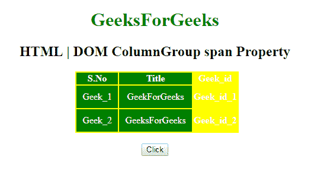
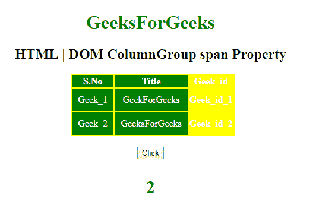
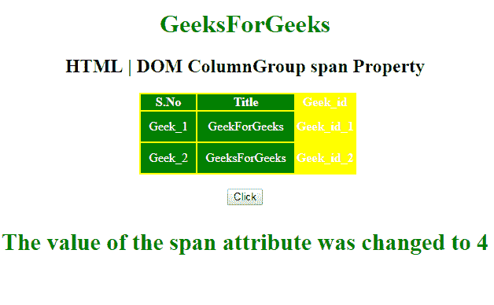

# HTML | DOM 列组跨度属性

> 原文:[https://www . geesforgeks . org/html-DOM-column group-span-property/](https://www.geeksforgeeks.org/html-dom-columngroup-span-property/)

HTML DOM 中的**列组跨度属性**用于设置或返回列组元素跨度属性的值。**跨度属性**用于定义<柱组>元素应跨越的柱数。

**语法:**

*   它返回列组跨度属性。

    ```html
    columngroupObject.span
    ```

*   它用于设置列组跨度属性。

    ```html
    columngroupObject.span = number
    ```

**属性值:**包含单值**数**，指定<列组>应跨越的数量。

**返回值:**返回一个代表列数的字符串值。

**示例 1:** 本示例返回 span 属性。

```html
<!DOCTYPE html> 
<html> 

<head> 
    <title> 
        HTML DOM ColumnGroup span property 
    </title> 

    <style> 
        #myColGroup { 
            background: green; 
        } 
        table { 
            color: white; 
            margin-left: 180px; 
            background: yellow; 
        } 
        #Geek_p { 
            color: green; 
            font-size: 30px; 
        } 
        td { 
            padding: 10px; 
        } 
    </style> 
</head> 

<body style="text-align:center;"> 

    <h1 style="color:green;"> 
            GeeksForGeeks 
        </h1> 

    <h2>HTML | DOM ColumnGroup span Property</h2>

    <table> 
        <colgroup id="myColGroup" span="2"></colgroup> 
        <tr> 
            <th>S.No</th> 
            <th>Title</th> 
            <th>Geek_id</th> 
        </tr> 
        <tr> 
            <td>Geek_1</td> 
            <td>GeekForGeeks</td> 
            <th>Geek_id_1</th> 
        </tr> 
        <tr> 
            <td>Geek_2</td> 
            <td>GeeksForGeeks</td> 
            <th>Geek_id_2</th> 
        </tr> 
    </table> 
    <br> 

    <button onclick="myGeeks()"> 
        Click 
    </button> 

    <h4> 
        <p id="Geek_p" style="color:green"></p> 
    </h4> 

    <!-- Script to use ColumnGroup span Property -->
    <script> 
        function myGeeks() { 
            var x = document.getElementById("myColGroup").span; 
            document.getElementById("Geek_p").innerHTML = x; 
        } 
    </script> 
</body> 

</html>                    
```

**输出:**
**点击按钮前:**

**点击按钮后:**


**示例 2:** 本示例设置跨度属性。

```html
<!DOCTYPE html> 
<html> 

<head> 
    <title> 
        HTML | DOM ColumnGroup span property 
    </title> 

    <style> 
        #myColGroup { 
            background: green; 
        } 
        table { 
            color: white; 
            margin-left: 180px; 
            background: yellow; 
        } 
        #Geek_p { 
            color: green; 
            font-size: 30px; 
        } 
        td { 
            padding: 10px; 
        } 
    </style> 
</head> 

<body style="text-align:center;"> 

    <h1 style="color:green;"> 
            GeeksForGeeks 
        </h1> 

    <h2>HTML | DOM ColumnGroup span Property</h2> 

    <table> 
        <colgroup id="myColGroup" span="2"> 
        </colgroup> 
        <tr> 
            <th>S.No</th> 
            <th>Title</th> 
            <th>Geek_id</th> 
        </tr> 
        <tr> 
            <td>Geek_1</td> 
            <td>GeekForGeeks</td> 
            <th>Geek_id_1</th> 
        </tr> 
        <tr> 
            <td>Geek_2</td> 
            <td>GeeksForGeeks</td> 
            <th>Geek_id_2</th> 
        </tr> 
    </table> 
    <br> 
    <button onclick="myGeeks()"> 
        Click 
    </button>

    <h4> 
        <p id="Geek_p" style="color:green"></p> 
    </h4> 

    <!-- Script to use DOM ColumnGroup span Property -->
    <script> 
        function myGeeks() { 
            var x = document.getElementById("myColGroup").span
                    = "4"; 
            document.getElementById("Geek_p").innerHTML
                    = "The value of the span attribute was"
                    + " changed to " + x; 
        } 
    </script> 
</body> 

</html>                    
```

**输出:**
**点击按钮前:**

**点击按钮后:**


**支持的浏览器:**T2 DOM Colgroup span 属性支持的浏览器如下:

*   谷歌 Chrome
*   微软公司出品的 web 浏览器
*   火狐浏览器
*   歌剧
*   旅行队