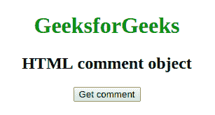
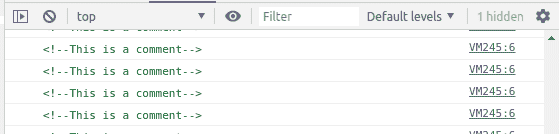

# HTML | DOM 注释()构造函数

> 原文:[https://www.geeksforgeeks.org/html-dom-comment-constructor/](https://www.geeksforgeeks.org/html-dom-comment-constructor/)

HTML DOM 中的**注释()构造函数**用于返回新创建的注释对象，可选参数为字符串。

**语法:**

```html
comment1 = new Comment(); // Create empty comment
comment2 = new Comment(*String*);
```

**参数:**该构造函数接受保存注释文本的单参数**字符串**。

**示例:**本示例创建一个以“这是注释”为参数的注释对象。

```html
<!DOCTYPE html>
<html>

<head>
    <title>
        HTML | DOM comment() constructor
    </title>

    <style>
        a:focus {
            background-color: magenta;
        }
    </style>
</head>

<body style="text-align:center;">

    <h1 style="color:green;"> 
        GeeksforGeeks 
    </h1>

    <h2>HTML comment object</h2>

    <button onclick="getcomment ();">
        Get comment
    </button>

    <p id='comment'></p>

    <script type="text/javascript">
        function getcomment() {
            let comment = 
                new Comment("This is a comment");

            console.log(comment);
        }
    </script>
</body>

</html>
```

**输出:**

*   **点击按钮前:**
    
*   **点击按钮，在控制台上看到结果:**
    

**支持的浏览器:***HTML DOM comment()构造函数*支持的浏览器如下:

*   谷歌 Chrome
*   Firefox 24
*   歌剧