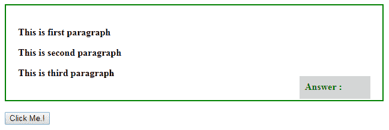
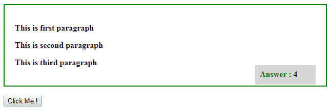
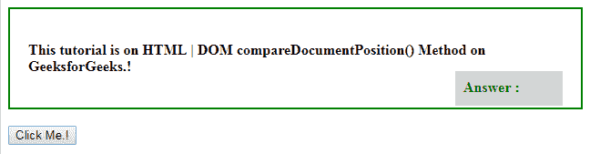
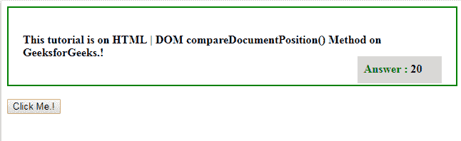

# HTML | DOM compareDocumentPosition()方法

> 原文:[https://www . geesforgeks . org/html-DOM-comparedocumentposition-method/](https://www.geeksforgeeks.org/html-dom-comparedocumentposition-method/)

**DOM compareDocumentPosition()**方法用于比较两个节点，它返回一个整数，描述它们在文档中的位置。

**语法:**

```html
node1.compareDocumentPosition(node2)
```

**返回值:**返回一个整数值，其含义如下:

*   **1:** 这意味着两个节点不属于同一个文档。
*   **2:** 这意味着两个节点 node1 位于 node2 之后。
*   **4:** 这意味着两个节点 node1 位于 node2 之前。
*   **8:** 这意味着两个节点 node1 位于 node2 内部。
*   **16:** 这意味着两个节点 node2 位于 node1 内部。
*   **32:** 这意味着两个节点没有关系或者是同一个元素上的两个属性。

**示例-1:** 这将只返回一个值。

## 超文本标记语言

```html
<!DOCTYPE html>
<html>
<style>
    div {
        width: 90%;
        height: 60%;
        padding: 20px;
        border: 2px solid green;
        font-weight: bold;
    }

    #ans {
        background-color: lightgrey;
        display: block;
        width: 100px;
        font-weight: bold;
        height: 20px;
        padding: 9px;
        color: green;
        float: right;
        margin-top: -20px;
    }

    #res {
        color: black;
    }
</style>

<body>
    <div>
        <p id="p1">
          This is first paragraph
        </p>

        <p id="p2">
          This is second paragraph
        </p>

        <p id="p3">
          This is third paragraph
        </p>

        <p id="ans">Answer : <span id="res"></span></p>

    </div>
    <br>

    <input type = button
           onclick="myFunction()" value =
           "Click Me.!" />
    <br>

    <script>
        function myFunction() {
            var x = p1.compareDocumentPosition(p2);
            document.getElementById("res").innerHTML = x;
        }
    </script>

</body>

</html>
```

**输出:**
**之前点击按钮:**



**点击按钮后:**



**示例-2:** 这将返回两个值的组合。

## 超文本标记语言

```html
<!DOCTYPE html>
<html>
<style>
    div {
        width: 90%;
        height: 60%;
        padding: 20px;
        border: 2px solid green;
        font-weight: bold;
    }

    #ans {
        background-color: lightgrey;
        display: block;
        width: 100px;
        font-weight: bold;
        height: 20px;
        padding: 9px;
        color: green;
        float: right;
        margin-top: -20px;
    }

    #res {
        color: black;
    }
</style>

<body>
    <div>

        <p id="p1">This tutorial is on
          <span id="p2">
             HTML | DOM compareDocumentPosition() Method
          </span> on GeeksforGeeks.!
        </p>

        <p id="ans">
          Answer :
          <span id="res"></span>
        </p>

    </div>
    <br>

    <input type=button onclick="myFunction()"
           value="Click Me.!" />
    <br>

    <script>
        function myFunction() {
            var x = p1.compareDocumentPosition(p2);
            document.getElementById("res").innerHTML = x;
        }
    </script>

</body>

</html>
```

**输出:**
**之前点击按钮:**



**点击按钮后:**答案为 20。“4”表示第一个节点位于第二个节点之前,“16”表示第二个节点位于第一个节点内部。



**注意:**返回值可以是值的组合。即，如果返回值是 20，这意味着 p2 在 p1‘16’内，而 P1 位于 p2‘4’之前。

**支持的浏览器:**

*   谷歌 Chrome
*   微软公司出品的 web 浏览器
*   火狐浏览器
*   歌剧
*   旅行队