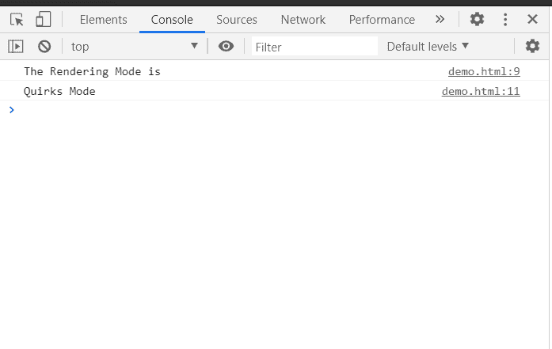

# HTML DOM 兼容模式属性

> 原文:[https://www.geeksforgeeks.org/html-dom-compatmode-property/](https://www.geeksforgeeks.org/html-dom-compatmode-property/)

HTML DOM 中的**兼容模式**属性表示文档呈现的模式，exp Quirks 模式或 Standards 模式。

**语法:**

```html
var mode = document.compatMode;
```

**返回值:**

*   如果文档在**模式下渲染，返回**背景对比**。**
*   如果文档是以**标准**模式或有限怪癖(也称为“几乎标准”)模式呈现的，则返回 **CSS1Compat** 。

**示例:**在本例中，我们将使用该属性获取文档模式。

## 超文本标记语言

```html
<!DOCTYPE html>
<html>

<body>
    <h1>GeeksforGeeks</h1>

    <script>
        console.log("The Rendering Mode is");
        if (document.compatMode == "BackCompat") {
            console.log("Quirks Mode");
        }
        else {
            console.log("Standards Mode");
        }
    </script>
</body>

</html>
```

**输出:**



**支持的浏览器:**

*   谷歌 Chrome
*   边缘
*   火狐浏览器
*   歌剧
*   旅行队