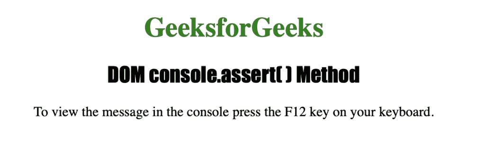
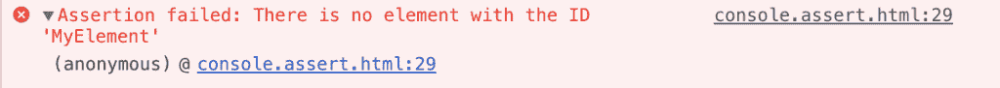
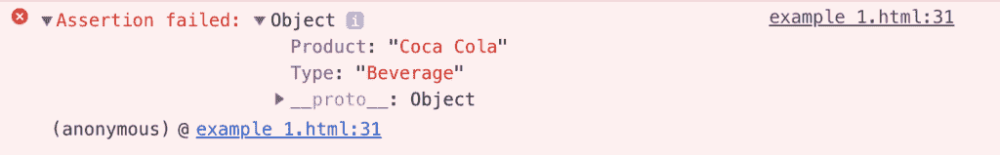

# HTML | DOM console.assert()方法

> 原文:[https://www . geesforgeks . org/html-DOM-console-assert-method/](https://www.geeksforgeeks.org/html-dom-console-assert-method/)

HTML 中的 **console.assert()** 方法仅在表达式计算为 false 时用于在控制台上为用户编写消息。表达式和消息作为参数发送给 console.assert()方法。

**语法:**

```html
console.assert( expression, message )
```

**参数:**该方法接受两个参数，如上所述，如下所述:

*   **表达式:**是一个布尔表达式，表示要写入控制台的消息或对象。它是必需的参数。
*   **消息:**它是一个字符串或对象，表示要写入控制台的消息或对象。它是必需的参数。

下面的程序用 HTML 说明了 console.assert()方法:

**例 1:**

```html
<!DOCTYPE html>
<html>
    <head> 
        <title>DOM console.assert() Method</title> 
        <style> 
            h1 { 
                color:green; 
            } 
            h2 {
                font-family: Impact;
            }
            body { 
                text-align:center; 
            } 
        </style> 
    </head>
    <body>
        <h1>GeeksforGeeks</h1> 
        <h2>DOM console.assert() Method</h2> 
        <p>To view the message in the console press the F12
        key on your keyboard.</p>
        <script>
            console.assert(document.getElementById("MyElement"), 
            "There is no element with the ID 'MyElement'");
        </script>
    </body>
</html>                    
```

**输出:**


**查看控制台视图按 F12 键:**


**示例 2:** 使用 console.assert()方法显示对象

```html
<!DOCTYPE html>
<html>
    <head> 
        <title>DOM console.assert() Method</title> 
        <style> 
            h1 { 
                color:green; 
            } 
            h2 {
                font-family: Impact;
            }
            body { 
                text-align:center; 
            } 
        </style> 
    </head>
    <body>
        <h1>GeeksforGeeks</h1> 
        <h2>DOM console.assert( ) Method</h2> 
        <p>To view the message in the console press the F12 key on 
             your keyboard.</p>
        <script>
            var MyElement = { Product : "Coca Cola", Type : "Beverage" };
            console.assert(document.getElementById("MyDemo"), MyElement);
        </script>
    </body>
</html>                    
```

**输出:**


**查看控制台视图按下 F12 键:**


**支持的浏览器:**下面列出了 *console.assert()* 方法支持的浏览器:

*   谷歌 Chrome
*   微软公司出品的 web 浏览器
*   Firefox 28.0
*   歌剧
*   旅行队