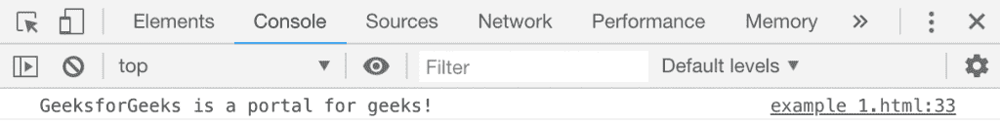

# HTML | DOM console.clear()方法

> 原文:[https://www . geesforgeks . org/html-DOM-console-clear-method/](https://www.geeksforgeeks.org/html-dom-console-clear-method/)

HTML 中的 **console.clear()** 方法用来清除控制台，每次执行时都会在控制台上写一些消息“console 已清除”。此方法不需要任何参数。

**语法:**

```html
console.clear()
```

下面的程序用 HTML 说明了 console.clear()方法:

**示例:**

```html
<!DOCTYPE html>
<html>
    <head> 
        <title>DOM console.clear() Method in HTML</title> 
        <style> 
            h1 { 
                color:green; 
            } 
            h2 {
                font-family: Impact;
            }
            body { 
                text-align:center; 
            } 
        </style> 
    </head>
    <body>
        <h1>GeeksforGeeks</h1> 
        <h2>DOM console.clear() Method</h2> 
        <p>To view the message in the console press the F12 
        key on your keyboard.</p>
        <p>
           To clear the console, double click 
           the button below:
        </p><br>
        <button ondblclick="clear_console()">
           Clear Console
        </button>
        <script>
            console.log("GeeksforGeeks is a portal for geeks!");
            function clear_console() {
                console.clear();
            }
        </script>
    </body>
</html>                    
```

**输出:**

**控制台视图按下键 F12:**


**双击清除按钮后查看控制台视图:**


**支持的浏览器:**下面列出了 *console.clear()* 方法支持的浏览器:

*   谷歌 Chrome
*   微软公司出品的 web 浏览器
*   火狐浏览器
*   歌剧
*   旅行队