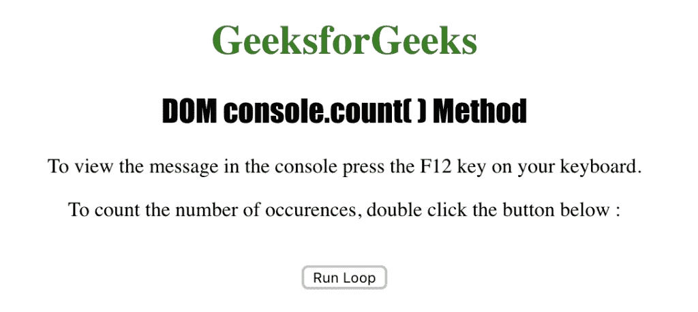

# HTML | DOM console.count()方法

> 原文:[https://www . geesforgeks . org/html-DOM-console-count-method/](https://www.geeksforgeeks.org/html-dom-console-count-method/)

HTML 中的 **console.count()** 方法用来写 **console.count()** 方法被调用的次数。可以将 **console.count()** 方法添加到将包含在控制台视图中的标签中。标签是发送到 console.count()方法的可选参数。

**语法:**

```html
console.count( label )
```

**参数:**该方法接受单参数*标签*，该标签为可选，用于统计使用该标签调用 console.count()的次数。

下面的程序用 HTML 说明了 console.count()方法:

**示例:**

```html
<!DOCTYPE html>
<html>
    <head> 
        <title>DOM console.count() Method</title> 
        <style> 
            h1 { 
                color:green; 
            } 
            h2 {
                font-family: Impact;
            }
            body { 
                text-align:center; 
            } 
        </style> 
    </head>
    <body>

        <h1>GeeksforGeeks</h1> 
        <h2>DOM console.count( ) Method</h2> 

        <p>
          To view the message in the console 
          press the F12 key on your keyboard.
        </p>
        <p>
          To count the number of occurences,
          double click thebutton below:
        </p><br>
        <button ondblclick="count_console()">
          Run Loop
        </button>

        <script>
            function count_console() {
                for (i = 0; i < 10; i++) {
                    console.count();
                }
            }
        </script>
    </body>
</html>                    
```

**输出:**

**双击【运行循环】按钮后查看控制台视图:**


**支持的浏览器:***console . count()方法*支持的浏览器如下:

*   谷歌 Chrome
*   微软公司出品的 web 浏览器
*   Firefox 30.0
*   歌剧
*   旅行队