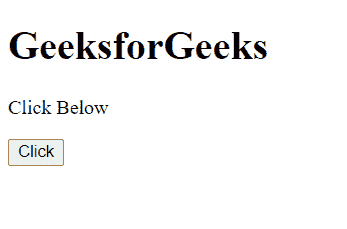
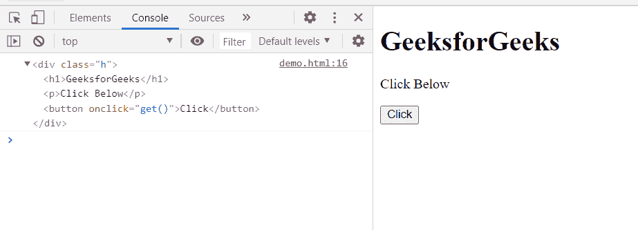

# HTML DOM console.dirxml()方法

> 原文:[https://www . geesforgeks . org/html-DOM-console-dirxml-method/](https://www.geeksforgeeks.org/html-dom-console-dirxml-method/)

**控制台 dirxml()方法**用于显示指定 **XML/HTML** 元素的后代元素的交互树。输出被表示为可扩展节点的分层对象，这也允许您查看子节点的内容。

**语法:**

```html
console.dirxml(*object_or_element*);
```

**参数:**

*   **对象:**这个方法取一个 JavaScript 对象或元素。

**返回值:**该方法返回对象元素的交互树。

**示例:**

```html
<!DOCTYPE html>
<html>
<head>
  <meta charset="utf-8">
  <title>DOM console dirxml() method example</title>
</head>
<body>
  <div class="h">
  <h1>GeeksforGeeks</h1>
  <p>Click Below</p>
  <button onclick="get()">Click</button>
  </div>
</body>
<script>
    function get(){
        console.dirxml(document.querySelector(".h"));
        }
</script>
</html>
```

**输出:**

**点击按钮前:**



**点击按钮后:**



**支持的浏览器:**

*   谷歌 Chrome
*   边缘
*   火狐浏览器
*   旅行队
*   歌剧
*   微软公司出品的 web 浏览器