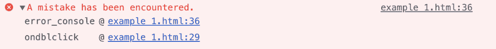

# HTML | DOM console.error()方法

> 原文:[https://www . geesforgeks . org/html-DOM-console-error-method/](https://www.geeksforgeeks.org/html-dom-console-error-method/)

HTML 中的 **console.error()** 方法用于在控制台上显示错误消息。**控制台.错误()**方法用于测试目的。错误信息作为参数发送到**控制台。错误()**方法。

**语法:**

```html
console.error( message )
```

**参数:**该方法接受单参数*信息*，该信息为强制信息，用于保存错误信息。

下面的程序用 HTML 说明了 console.error()方法:

**示例:**

```html
<!DOCTYPE html>
<html>
    <head> 
        <title>DOM console.error() Method</title> 
        <style> 
            h1 { 
                color:green; 
            } 
            h2 {
                font-family: Impact;
            }
            body { 
                text-align:center; 
            } 
        </style> 
    </head>
    <body>
        <h1>GeeksforGeeks</h1> 
        <h2>DOM console.error() Method</h2> 

        <p>
           To view the message in the console
           press the F12 key on your keyboard.
        </p>
        <p>
           To check for errors, double click 
           the button below:
        </p><br>
        <button ondblclick="error_console()">
           Check Errors
        </button>
        <script>
            function error_console() {
                console.error("A mistake has been encountered.");
            }
            </script>
    </body>
</html>                    
```

**输出:**

**显示控制台视图后双击【检查错误】按钮:**


**支持的浏览器:***控制台支持的浏览器，错误()*方法如下:

*   谷歌 Chrome
*   Internet Explorer 8.0
*   Firefox 4.0
*   歌剧
*   旅行队