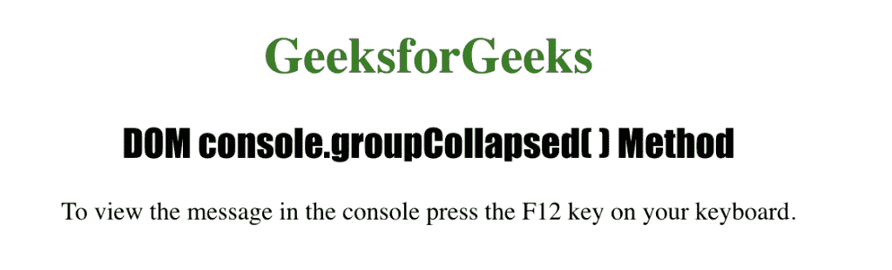
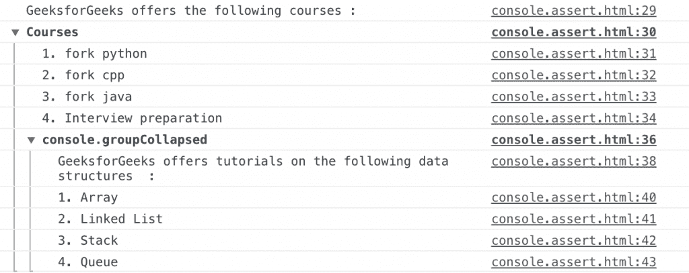
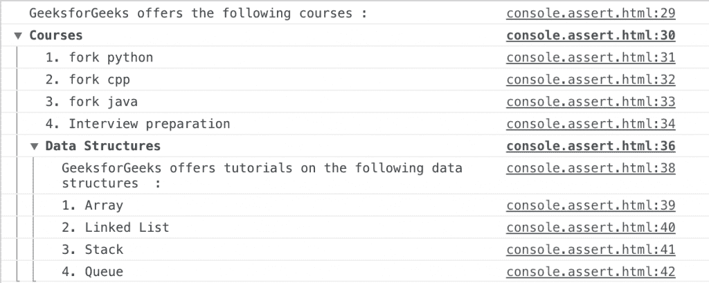

# HTML | DOM console . group collapsed()方法

> 原文:[https://www . geesforgeks . org/html-DOM-console-group collapsed-method/](https://www.geeksforgeeks.org/html-dom-console-groupcollapsed-method/)

HTML 中的 **console.groupCollapsed()** 方法用于在控制台中创建一组折叠的消息。它指示折叠消息组的开始，调用 **console.groupCollapsed()** 方法后写入的所有消息都将写入消息组。该标签作为可选参数发送给 console.groupCollapsed()方法。

**语法:**

```html
console.groupCollapsed( label )
```

**参数:**该方法接受单参数*标签*，该标签为可选，用于指定折叠组的标签。

下面的程序用 HTML 说明了 console.groupCollapsed()方法:

**例 1:**

```html
<!DOCTYPE html>
<html>
    <head> 
        <title>DOM console.groupCollapsed() Method</title> 
        <style> 
            h1 { 
                color:green; 
            } 
            h2 {
                font-family: Impact;
            }
            body     { 
                text-align:center; 
            } 
        </style> 
    </head>
    <body>
        <h1>GeeksforGeeks</h1> 
        <h2>DOM console.groupCollapsed( ) Method</h2> 
        <p>
         To view the message in the console 
         press the F12 key on your keyboard.
        </p>
        <script>
            console.log("GeeksforGeeks offers the following courses :");
            console.group("Courses");
            console.log("1\. fork python");
            console.log("2\. fork cpp");
            console.log("3\. fork java");
            console.log("4\. Interview preparation");
            console.groupCollapsed();
            console.log("GeeksforGeeks offers tutorials on the" +
            "following data structures :");
            console.log("1\. Array");
            console.log("2\. Linked List");
            console.log("3\. Stack");
            console.log("4\. Queue");
            console.groupEnd();
        </script>
    </body>
</html>                    
```

**输出:**

**控制台视图:**


**示例 2:** 使用 console.groupCollapsed()方法使用标签参数

```html
<!DOCTYPE html>
<html>
    <head> 
        <title>DOM console.groupCollapsed() Method</title> 
        <style> 
            h1 { 
                color:green; 
            } 
            h2 {
                font-family: Impact;
            }
            body { 
                text-align:center; 
            } 
        </style> 
    </head>
    <body>
        <h1>GeeksforGeeks</h1> 
        <h2>DOM console.groupCollapsed() Method</h2> 
        <p>
         To view the message in the console
         press the F12 key on your keyboard.
        </p>
        <script>
            console.log("GeeksforGeeks offers the following courses :");
            console.group("Courses");
            console.log("1\. fork python");
            console.log("2\. fork cpp");
            console.log("3\. fork java");
            console.log("4\. Interview preparation");
            console.groupCollapsed("Data Structures");
            console.log("GeeksforGeeks offers tutorials on the" +
            "following data structures :");
            console.log("1\. Array");
            console.log("2\. Linked List");
            console.log("3\. Stack");
            console.log("4\. Queue");
            console.groupEnd();
        </script>
    </body>
</html>                    
```

**输出:**

**控制台视图:**


**支持的浏览器:**下面列出了 *console.groupCollapsed()* 方法支持的浏览器:

*   谷歌 Chrome 6.0
*   Internet Explorer 11.0
*   Firefox 9.0
*   歌剧
*   Safari 5.1