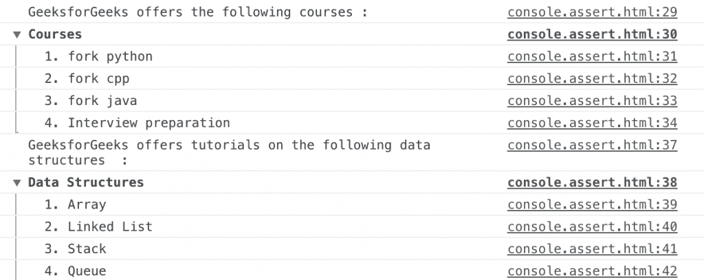

# HTML | DOM console.groupEnd()方法

> 原文:[https://www . geesforgeks . org/html-DOM-console-group end-method/](https://www.geeksforgeeks.org/html-dom-console-groupend-method/)

HTML 中的 **console.groupEnd()** 方法用于指示使用 console.group()方法创建的控制台中一组消息的结束。此方法不接受任何参数。

**语法:**

```html
console.groupEnd()
```

下面的程序用 HTML 说明了 console.groupEnd()方法:

**示例:**

```html
<!DOCTYPE html>
<html>
    <head> 
        <title>DOM console.groupEnd() Method</title> 
        <style> 
            h1 { 
                color:green; 
            } 
            h2 {
                font-family: Impact;
            }
            body { 
                text-align:center; 
            } 
        </style> 
    </head>
    <body>
        <h1>GeeksforGeeks</h1> 
        <h2>DOM console.groupEnd() Method</h2> 
        <p>To view the message in the console press the F12
        key on your keyboard.</p>
        <script>
            console.log
            ("GeeksforGeeks offers the following courses:");
            console.group("Courses");
            console.log("1\. fork python");
            console.log("2\. fork cpp");
            console.log("3\. fork java");
            console.log("4\. Interview preparation");
            console.groupEnd();
            console.log("GeeksforGeeks offers tutorials on the " +
            "following data structures :");
            console.group("Data Structures");
            console.log("1\. Array");
            console.log("2\. Linked List");
            console.log("3\. Stack");
            console.log("4\. Queue");
            console.groupEnd();
        </script>
    </body>
</html>                    
```

**输出:**

**控制台视图:**


**支持的浏览器:**下面列出了 *console.groupEnd()* 方法支持的浏览器:

*   谷歌 Chrome
*   Internet Explorer 11.0
*   Firefox 4.0
*   歌剧
*   Safari 4.0