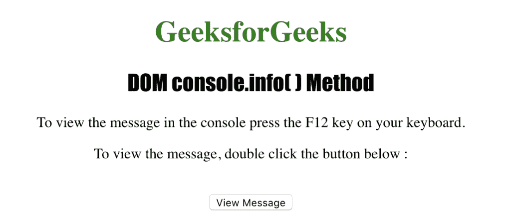
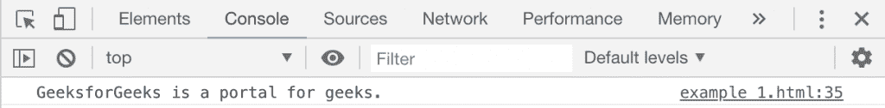
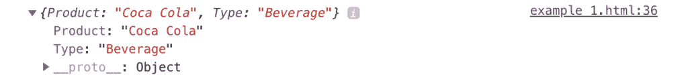

# HTML | DOM console.info()方法

> 原文:[https://www.geeksforgeeks.org/html-dom-console-info-method/](https://www.geeksforgeeks.org/html-dom-console-info-method/)

HTML 中的 **console.info()** 方法用于在控制台中写入消息。它表示关于任何元素或对象的重要信息。该消息作为参数发送到**控制台。信息()方法**。

**语法:**

```html
console.info( message )

```

**参数:**该方法接受单参数*消息*，该消息是强制性的，用于指定要写入控制台的信息。

下面的程序说明了 HTML 中的 DOM console.info()方法:

**例 1:**

## 超文本标记语言

```html
<!DOCTYPE html>
<html>
    <head>
        <title>DOM console.info() Method</title>
        <style>
            h1 {
                color:green;
            }
            h2 {
                font-family: Impact;
            }
            body {
                text-align:center;
            }
        </style>
    </head>
    <body>
        <h1>GeeksforGeeks</h1>
        <h2>DOM console.info() Method</h2>

<p>To view the message in the console press the F12
        key on your keyboard.</p>

<p>
         To view the message, double click the button below:
        </p>
<br>
        <button ondblclick="info_console()">
         View Message
        </button>
        <script>
            function info_console() {
                console.info
                  ("GeeksforGeeks is a portal for geeks.");
            }
        </script>
    </body>
</html>                   
```

**输出:**



**控制台视图:**



**示例 2:** 使用 DOM console.info()方法显示对象

## 超文本标记语言

```html
<!DOCTYPE html>
<html>
    <head>
        <title>DOM console.info() Method</title>
        <style>
            h1 {
                color:green;
            }
            h2 {
                font-family: Impact;
            }
            body {
                text-align:center;
            }
        </style>
    </head>
    <body>
        <h1>GeeksforGeeks</h1>
        <h2>DOM console.info( ) Method</h2>

<p>
         To view the message in the console
         press the F12 key on your keyboard.
        </p>

<p>
         To view the message, double click the button below:
        </p>
<br>
        <button ondblclick="info_console()">
         View Message
        </button>
        <script>
            function info_console()  {
                var MyElement =
                  { Product : "Coca Cola", Type : "Beverage" };
                console.info(MyElement);
            }
        </script>
    </body>
</html>                   
```

**输出:**


**控制台视图:**



**支持的浏览器:**DOM*console . info()*方法支持的浏览器如下:

*   谷歌 Chrome
*   Internet Explorer 8.0
*   Firefox 4.0
*   歌剧
*   旅行队