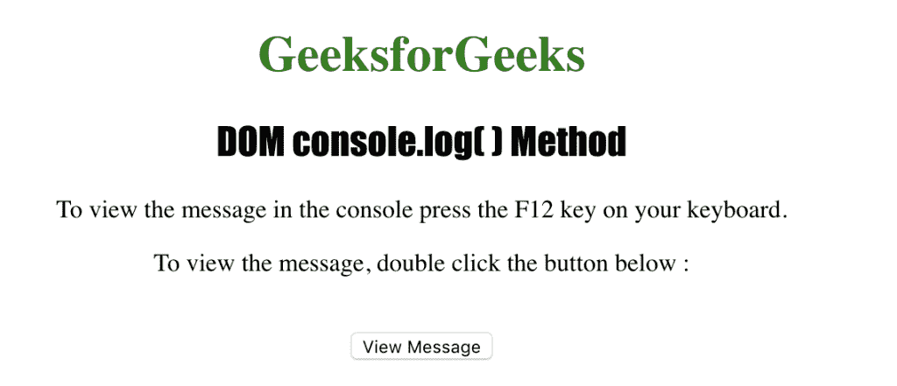
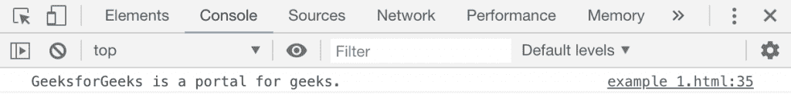
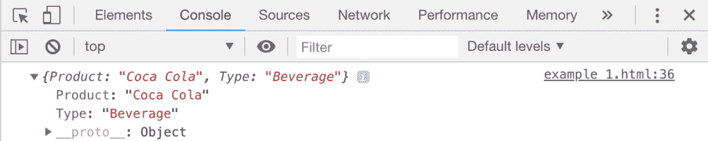

# HTML | DOM console.log()方法

> 原文:[https://www.geeksforgeeks.org/html-dom-console-log-method/](https://www.geeksforgeeks.org/html-dom-console-log-method/)

HTML 中的 **console.log()** 方法用于在控制台中写入消息。在测试任何程序时，它都会显示一条重要信息。该消息作为参数发送到**控制台. log()方法**。

**语法:**

```html
console.log( message )
```

**参数:**该方法接受单参数*消息*，该消息是强制性的，用于指定要写入控制台的信息。

下面的程序用 HTML 说明了 console.log()方法:
**示例 1:**

```html
<!DOCTYPE html>
<html>

<head>
    <title>DOM console.log() Method</title>
    <style>
        h1 {
            color: green;
        }

        h2 {
            font-family: Impact;
        }

        body {
            text-align: center;
        }
    </style>
</head>

<body>
    <h1>GeeksforGeeks</h1>
    <h2>DOM console.log() Method</h2>
    <p>
        To view the message in the console 
        press the F12 key on your keyboard.
    </p>
    <p>
        To view the message, double click
        the button below:
    </p>
    <br>
    <button ondblclick="log_console()">
        View Message
    </button>
    <script>
        function log_console() {
            console.log
                ("GeeksforGeeks is a portal for geeks.");
        }
    </script>
</body>

</html>
```

**输出:**

**控制台视图:**


**示例 2:** 使用 console.log()方法显示对象

```html
<!DOCTYPE html>
<html>

<head>
    <title>DOM console.log() Method</title>
    <style>
        h1 {
            color: green;
        }

        h2 {
            font-family: Impact;
        }

        body {
            text-align: center;
        }
    </style>
</head>

<body>
    <h1>GeeksforGeeks</h1>
    <h2>DOM console.log( ) Method</h2>
    <p>
        To view the message in the console
        press the F12 key on your keyboard.
    </p>
    <p>
        To view the message, double click
        the button below:
    </p>
    <br>
    <button ondblclick="log_console()">
        View Message
    </button>
    <script>
        function log_console() {
            var MyElement = {
                Product: "Coca Cola",
                Type: "Beverage"
            };
            console.log(MyElement);
        }
    </script>
</body>

</html>
```

**输出:**

**控制台视图:**


**支持的浏览器:***console . log()方法*支持的浏览器如下:

*   谷歌 Chrome
*   Internet Explorer 8.0
*   Firefox 4.0
*   歌剧
*   旅行队