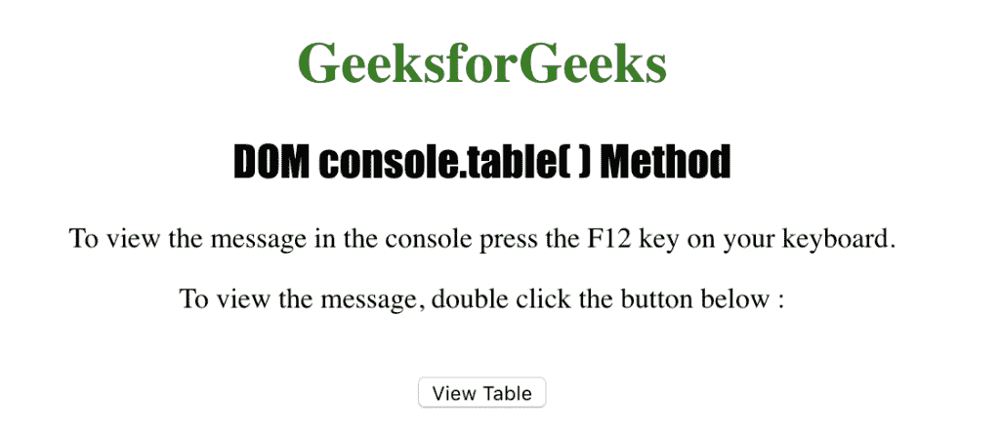
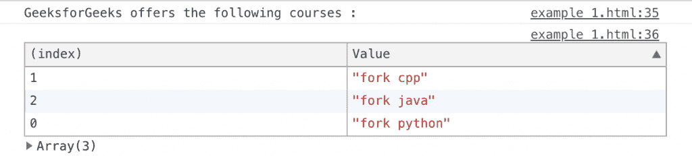
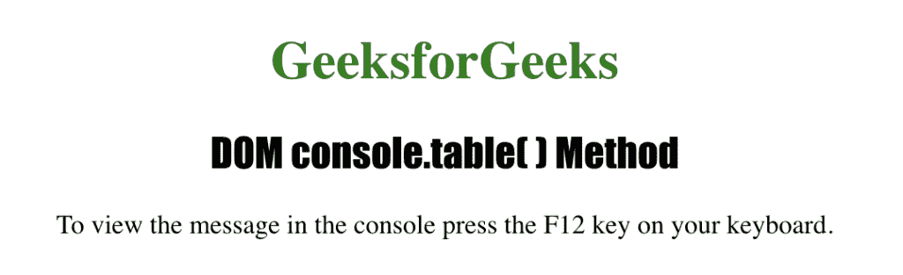
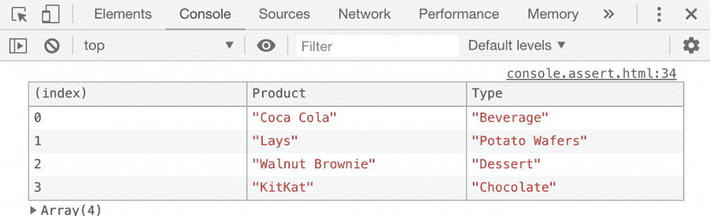
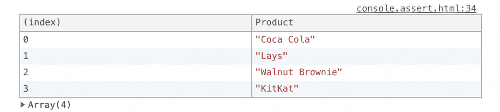

# HTML | DOM console.table()方法

> 原文:[https://www . geesforgeks . org/html-DOM-console-table-method/](https://www.geeksforgeeks.org/html-dom-console-table-method/)

HTML 中的 **console.table()** 方法用于在控制台视图中以表格形式写入数据。表数据作为参数发送到**控制台。table()** 方法，该方法必须是一个包含要填充到表中的数据的对象或数组。

**语法:**

```html
console.table( tabledata, tablecolumns );
```

**参数:**该方法接受两个参数，如上所述，如下所述:

*   **tabledata:** 是指定要写入表中的信息的强制参数。
*   **tablecolumns:** 它是一个可选参数，用于指定表中包含的列的名称。

下面的程序用 HTML 说明了 console.table()方法:

**例 1:**

```html
<!DOCTYPE html>
<html>

<head>
    <title>DOM console.table( ) Method in HTML</title>
    <style>
        h1 {
            color: green;
        }

        h2 {
            font-family: Impact;
        }

        body {
            text-align: center;
        }
    </style>
</head>

<body>
    <h1>GeeksforGeeks</h1>
    <h2>DOM console.table( ) Method</h2>
    <p>
       To view the message in the console
       press the F12 key on your keyboard.
    </p>
    <p>
       To view the message, double click 
       the button below:
    </p>
    <br>
    <button ondblclick="table_console()">
      View Table
    </button>
    <script>
        function table_console() {
            console.log
                ("GeeksforGeeks offers the following courses :");
            console.table
                ["fork python", "fork cpp", "fork java"]);
        }
    </script>
</body>

</html>
```

**输出:**

**控制台视图:**


**示例 2:** 使用 console.table()方法使用对象数组。

```html
<!DOCTYPE html>
<html>

<head>
    <title>DOM console.table( ) Method in HTML</title>
    <style>
        h1 {
            color: green;
        }

        h2 {
            font-family: Impact;
        }

        body {
            text-align: center;
        }
    </style>
</head>

<body>
    <h1>GeeksforGeeks</h1>
    <h2>DOM console.table() Method</h2>
    <p>
      To view the message in the console 
      press the F12 key on your keyboard.
    </p>
    <script>
        var Product1 = {
            Product: "Coca Cola",
            Type: "Beverage"
        }
        var Product2 = {
            Product: "Lays",
            Type: "Potato Wafers"
        }
        var Product3 = {
            Product: "Walnut Brownie",
            Type: "Dessert"
        }
        var Product4 = {
            Product: "KitKat",
            Type: "Chocolate"
        }
        console.table
            ([Product1, Product2, Product3, Product4]);
    </script>
</body>

</html>  
```

**输出:**

**控制台视图:**


**示例 3:** 使用 console.table()方法仅显示特定的列

```html
<!DOCTYPE html>
<html>

<head>
    <title>DOM console.table( ) Method in HTML</title>
    <style>
        h1 {
            color: green;
        }

        h2 {
            font-family: Impact;
        }

        body {
            text-align: center;
        }
    </style>
</head>

<body>
    <h1>GeeksforGeeks</h1>
    <h2>DOM console.table( ) Method</h2>
    <p>
       To view the message in the console
       press the F12 key on your keyboard.
    </p>
    <script>
        var Product1 = {
            Product: "Coca Cola",
            Type: "Beverage"
        }
        var Product2 = {
            Product: "Lays",
            Type: "Potato Wafers"
        }
        var Product3 = {
            Product: "Walnut Brownie",
            Type: "Dessert"
        }
        var Product4 = {
            Product: "KitKat",
            Type: "Chocolate"
        }
        console.table
            ([Product1, Product2, Product3, Product4], ["Product"]);
    </script>
</body>

</html>   
```

**输出:**

**控制台视图:**


**支持的浏览器:***控制台. table()方法*支持的浏览器如下:

*   谷歌 Chrome
*   Internet Explorer 12.0
*   Firefox 34.0
*   歌剧
*   旅行队