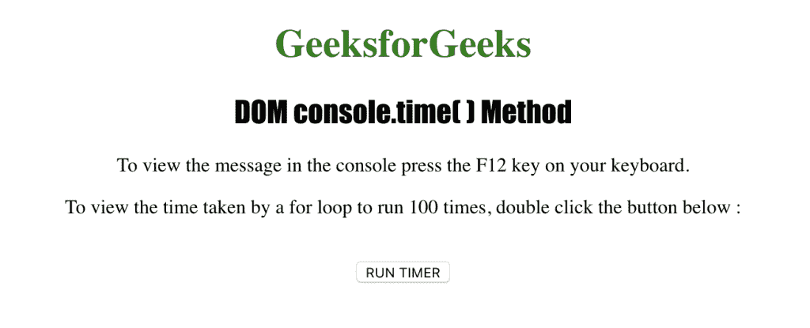
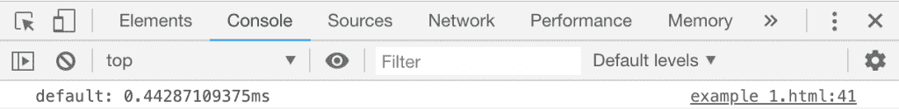
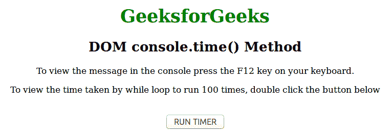
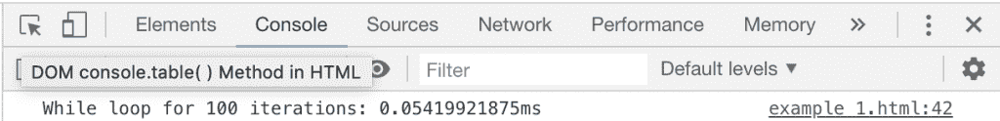

# HTML | DOM console.time()方法

> 原文:[https://www.geeksforgeeks.org/html-dom-console-time-method/](https://www.geeksforgeeks.org/html-dom-console-time-method/)

HTML 中的 **console.time()** 方法用于在控制台视图中启动定时器。 **console.time()** 方法可用于计算各种测试目的的程序时间。标签作为参数发送到**控制台。时间()方法**。

**语法:**

```html
console.time( label )
```

**参数:**该方法接受单参数*标签*，该标签为可选，用于指定定时器的标签。

下面的程序用 HTML 说明了 console.time()方法:

**例 1:**

```html
<!DOCTYPE html>
<html>

<head>
    <title>DOM console.time() Method in HTML</title>
    <style>
        h1 {
            color: green;
        }

        h2 {
            font-family: Impact;
        }

        body {
            text-align: center;
        }
    </style>
</head>

<body>
    <h1>GeeksforGeeks</h1>
    <h2>DOM console.time() Method</h2>
    <p>
      To view the message in the console
      press the F12 key on your keyboard.
    </p>
    <p>
      To view the time taken by a for loop
      to run 100 times, double click the 
      button below:
    </p>
    <br>
    <button ondblclick="table_time()">
      RUN TIMER
    </button>
    <script>
        function table_time() {
            console.time();
            for (i = 0; i < 100; i++) {
                // Random code
            }
            console.timeEnd();
        }
    </script>
</body>

</html>   
```

**输出:**

**控制台视图:**


**示例 2:** 使用 console.time()方法计算 while 循环所用的时间

```html
<!DOCTYPE html>
<html>

<head>
    <title>DOM console.time() Method in HTML</title>
    <style>
        h1 {
            color: green;
        }

        h2 {
            font-family: Impact;
        }

        body {
            text-align: center;
        }
    </style>
</head>

<body>
    <h1>GeeksforGeeks</h1>
    <h2>DOM console.time() Method</h2>
    <p>
      To view the message in the console
      press the F12 key on your keyboard.
    </p>
    <p>
      To view the time taken by a for loop
      to run 100 times, double click the
      button below:
    </p>
    <br>
    <button ondblclick="table_time()">
      RUN TIMER
    </button>
    <script>
        function table_time() {
            i = 0;
            console.time
                ("While loop for 100 iterations");
            while (i < 100) {
                i++;
            }
            console.timeEnd
                ("While loop for 100 iterations");
        }
    </script>
</body>

</html>
```

**输出:**

**控制台视图:**


**支持的浏览器:***console . time()方法*支持的浏览器如下:

*   谷歌 Chrome
*   Internet Explorer 11.0
*   Firefox 10.0
*   歌剧
*   Safari 4.0