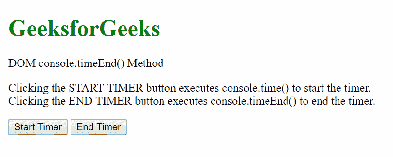
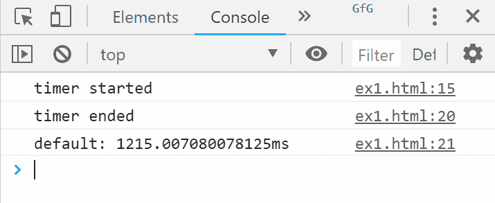
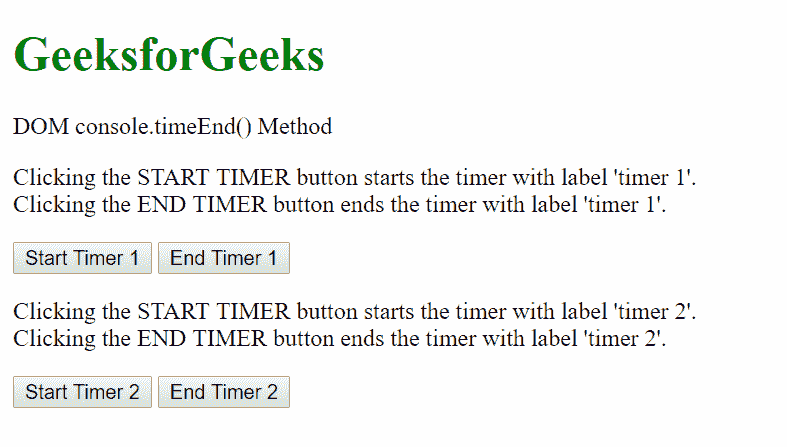
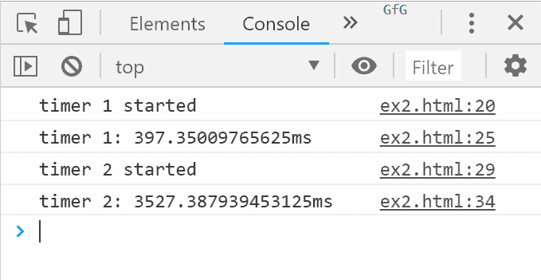

# HTML | DOM console.timeEnd()方法

> 原文:[https://www . geesforgeks . org/html-DOM-console-time end-method/](https://www.geeksforgeeks.org/html-dom-console-timeend-method/)

HTML 中的 **console.timeEnd()** 方法用于结束由 **console.time()** 方法启动的计时器。出于测试目的，这可以用来计算某些操作的时间。

**语法:**

```html
console.timeEnd( label )
```

**参数:**该方法接受单参数*标签*，可选。它用于指定要停止的计时器的标签。

**例 1:**

```html
<!DOCTYPE html>
<html>

<head>
    <title>
        DOM console.timeEnd() Method
    </title>
</head>

<body>
    <h1 style="color: green">
            GeeksforGeeks
        </h1>

    <p>DOM console.timeEnd() Method</p>

    <p>
        Clicking the START TIMER button executes
        console.time() to start the timer.<br> 
        Clicking the END TIMER button executes
        console.timeEnd() to end the timer.
    </p>

    <button onclick="start_timer()">
        Start Timer
    </button>

    <button onclick="end_timer()">
        End Timer
    </button>

    <script>
        // Function to start timer
        function start_timer() {
            console.log('timer started');
            console.time();
        }

        // Function to end timer
        function end_timer() {
            console.timeEnd();
        }
    </script>
</body>

</html>      
```

**输出:**

**控制台视图:**


**例 2:**

```html
<!DOCTYPE html>
<html>

<head>
    <title>
        DOM console.timeEnd() Method
    </title>
</head>

<body>
    <h1 style="color: green">
            GeeksforGeeks
        </h1>

    <p>DOM console.timeEnd() Method</p>

    <p>
        Clicking the START TIMER button starts
        the timer with label 'timer 1'.<br>
        Clicking the END TIMER button ends the
        timer with label 'timer 1'.
    </p>

    <button onclick="start_timer_one()">
        Start Timer 1
    </button>

    <button onclick="end_timer_one()">
        End Timer 1
    </button>

    <p>
        Clicking the START TIMER button starts 
        the timer with label 'timer 2'.<br> 
        Clicking the END TIMER button ends the
        timer with label 'timer 2'.
    </p>

    <button onclick="start_timer_two()">
        Start Timer 2
    </button>

    <button onclick="end_timer_two()">
        End Timer 2
    </button>

    <script>
        // Start first timer
        function start_timer_one() {
            console.log('timer 1 started');
            console.time('timer 1');
        }

        // End first timer
        function end_timer_one() {
            console.timeEnd('timer 1');
        }

        // Start second timer
        function start_timer_two() {
            console.log('timer 2 started');
            console.time('timer 2');
        }

        // End second timer
        function end_timer_two() {
            console.timeEnd('timer 2');
        }
    </script>
</body>

</html>
```

**输出:**

**控制台视图:**


**支持的浏览器:**支持的浏览器*控制台. timeEnd()方法*如下:

*   谷歌 Chrome
*   Internet Explorer 11.0
*   Firefox 10.0
*   歌剧
*   Safari 4.0