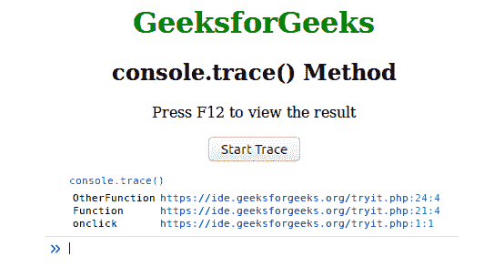

# HTML | DOM console.trace()方法

> 原文:[https://www . geesforgeks . org/html-DOM-console-trace-method/](https://www.geeksforgeeks.org/html-dom-console-trace-method/)

这个 **console.trace()** 方法用来显示代表代码如何在某个点结束的跟踪。

**语法:**

```html
console.trace( label )
```

**参数:**该方法接受单参数标签。

**示例:**

```html
<!DOCTYPE html>
<html>
    <head>
        <title>console.trace() Method</title>
        <style>
            h1 {
                color:green;
            }
            body {
                text-align:center;
            }
        </style>
    </head>
    <body>
        <h1>GeeksforGeeks</h1>
        <h2>console.trace() Method</h2>
        <p>Press F12 to view the result</p>
        <button onclick="Function()">Start Trace</button>
        <script>
            function Function() {
              OtherFunction();
            }
            function OtherFunction() {
              console.trace();
            }
        </script>

    </body>
</html>
```

**输出:**


**支持的浏览器:**下面列出了 *console.trace()* 方法支持的浏览器:

*   铬
*   Internet Explorer 11.0
*   Firefox 10.0
*   歌剧
*   Safari 4.0