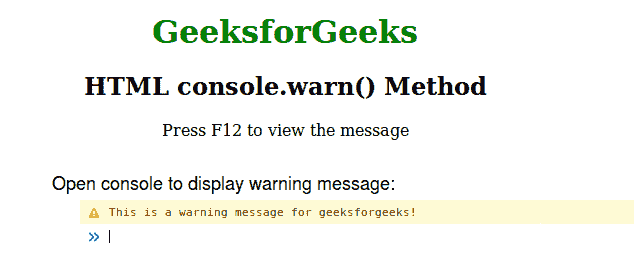
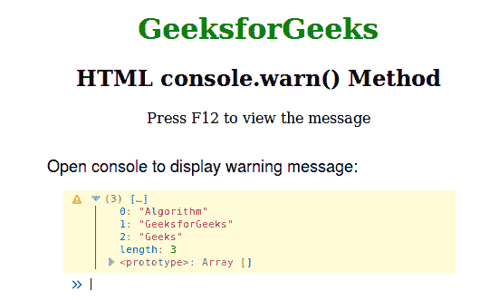

# HTML | DOM console.warn()方法

> 原文:[https://www.geeksforgeeks.org/html-dom-console-warn-method/](https://www.geeksforgeeks.org/html-dom-console-warn-method/)

**console.warn()** 方法用于在控制台中写入警告消息。因此打开控制台显示输出(警告消息)。

**语法:**

```html
console.warn( message )
```

**参数:**该方法接受单参数*消息*，该消息为必填项。此参数用于保存警告消息。

**例 1:**

```html
<!DOCTYPE html>
<html>

<head>
    <title>console.warn() Method</title>
    <style>
        h1 {
            color: green;
        }

        body {
            text-align: center;
        }
    </style>
</head>

<body>
    <h1>GeeksforGeeks</h1>
    <h2>HTML console.warn() Method</h2>
    <p>Press F12 to view the message</p>
    <script>
        console.warn
            ("This is a warning message for geeksforgeeks!");
    </script>
</body>

</html>
```

**输出:**


**例 2:**

```html
<!DOCTYPE html>
<html>

<head>
    <title>console.warn() Method</title>
    <style>
        h1 {
            color: green;
        }

        body {
            text-align: center;
        }
    </style>
</head>

<body>
    <h1>GeeksforGeeks</h1>
    <h2>HTML console.warn() Method</h2>
    <p>Press F12 to view the message</p>
    <script>
        var Arr = ["Algorithm", "GeeksforGeeks", "Geeks"];
        console.warn(Arr);
    </script>
</body>

</html>
```

**输出:**


**支持的浏览器:**下面列出了 *console.warn()* 方法支持的浏览器:

*   铬
*   Internet Explorer 8.0
*   Firefox 4.0
*   歌剧
*   旅行队