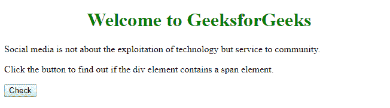
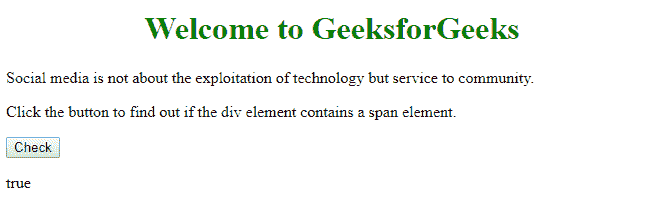

# HTML | DOM 包含()方法

> 原文:[https://www.geeksforgeeks.org/html-dom-contains-method/](https://www.geeksforgeeks.org/html-dom-contains-method/)

**contains()** 方法用于查找指定节点是否是给定节点的后代。
这个后代可以是孩子、孙儿、曾孙等等。

**语法:**

```html
node.contains( otherNode ) 

```

**参数:**语法中的“othernode”是这个函数需要的参数。

**返回值:**如果节点是给定节点 else **的后代，则返回**true**false。**

**示例:**

```html
<!DOCTYPE html>
<html>

<head>
    <title>HTML | DOM contains() Method</title>
    <!--script to check, if a node contains descendant-->
    <script>
        function containchild() {
            var span = 
            document.getElementById("sp1");
            var div = 
            document.getElementById("para1").contains(span);
            document.getElementById("result").innerHTML = div;
        }
    </script>
</head>

<body>
    <center>
        <h1 style="color:green">
            Welcome to GeeksforGeeks</h1></center>
    <div id="para1">
        <p>Social media is not about the 
        <span id="sp1">exploitation of technology</span> 
        but service to community.</p>
    </div>

    <p>Click the button to find out if the div
    element contains a span element.</p>

    <button onclick="containchild()">Check</button>

    <!--for displaying boolean value -->
    <p id="result"></p>
</body>

</html>                    
```

**输出:**
**点击前检查按钮:**


**点击后勾选按钮:**


**支持的浏览器:**DOM contain()方法支持的浏览器如下:

*   谷歌 Chrome
*   微软公司出品的 web 浏览器
*   火狐浏览器
*   歌剧
*   旅行队