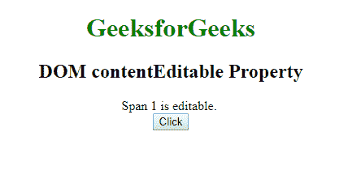
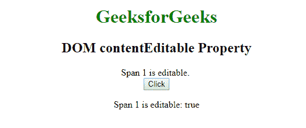

# HTML | DOM 内容可编辑属性

> 原文:[https://www . geesforgeks . org/html-DOM-content editable-property/](https://www.geeksforgeeks.org/html-dom-contenteditable-property/)

DOM contentEditable 属性用于返回一个布尔值，其中 true 表示元素的内容可编辑，false 表示内容不可编辑。此属性是只读的。

**语法:**

*   **返回内容可编辑属性:**

    ```html
    HTMLElementObject.contentEditable
    ```

*   **设置内容可编辑属性:**

    ```html
    HTMLElementObject.contentEditable = true | false
    ```

**返回值:**该属性返回一个布尔值:

*   true–表示元素的内容是可编辑的。
*   false–表示柠檬的内容不可编辑。

**示例:**

```html
<!DOCTYPE html> 
<html> 

<head> 
    <title> 
        DOM iscontentEditable Property 
    </title> 
</head> 

<body style="text-align: center"> 
    <h1 style="color:green"> 
            GeeksforGeeks 
        </h1> 

    <h2> 
        DOM contentEditable Property 
    </h2>

    <span id="P" contenteditable="true"> 
        Span 1 is editable.
    </span> 
    <br> 

    <button onclick="GFGFun()"> 
        Click
    </button> 

    <p id="pid"></p> 
    <p id="pid1"></p> 

    <script> 
        function GFGFun() { 
            var gfgvar = 
                document.getElementById("P").isContentEditable; 

            document.getElementById("pid").innerHTML = 
                "Span 1 is editable: " + gfgvar; 
        } 
    </script> 
</body> 

</html>
```

**输出:**

*   **之前点击按钮:**
    
*   **点击按钮后:**
    

**支持的浏览器:**内容可编辑属性支持的浏览器如下:

*   铬
*   火狐浏览器
*   微软公司出品的 web 浏览器
*   歌剧
*   旅行队