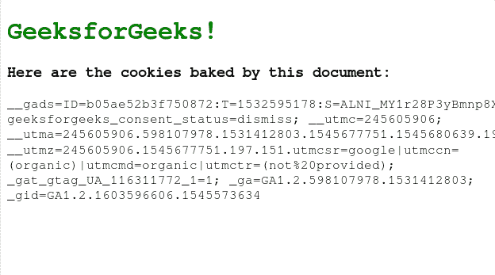
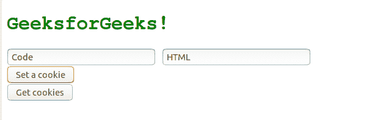
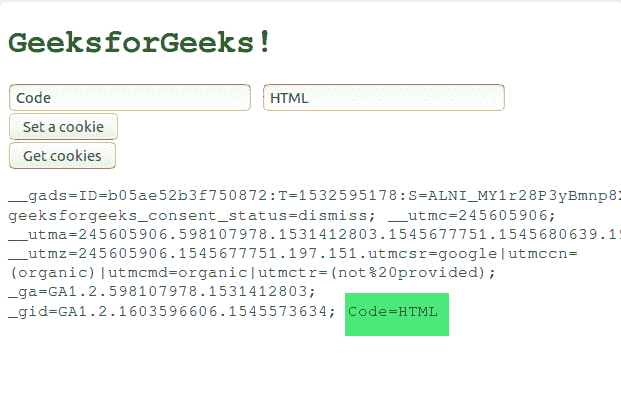

# HTML | DOM cookie 属性

> 原文:[https://www.geeksforgeeks.org/html-dom-cookie-property/](https://www.geeksforgeeks.org/html-dom-cookie-property/)

几乎每个网站都会将 cookies(小文本文件)存储在用户的计算机上，以便识别和跟踪用户的偏好。DOM cookie 属性设置或获取与当前文档相关联的 cookie 的所有键/值对。
**获取所有 cookie:**
**文档. cookie** 方法返回一个字符串，该字符串包含当前文档的所有 cookie(键=值对)的分号分隔列表。
**语法:**

```html
document.cookie
```

下面是获取与当前文档相关的所有 cookies 的程序:

## 超文本标记语言

```html
<!DOCTYPE html>
<html>
<head>
    <title>Cookie</title>
    <style>
        h1{
            color:green
        }
    </style>
</head>

<body onload="getCookies()">
    <h1>GeeksforGeeks!</h1>
    <h3>Here are the cookies baked by this document:</h3>

    <!-- Paragraph element to display all cookies -->
    <p id="cookies"></p>

    <!-- Fetch cookies and display them in the
        above paragraph element -->
    <script>
        function getCookies() {
            document.getElementById("cookies").innerHTML =
                                        document.cookie;
        }
    </script>
</body>
</html>                   
```

**输出:**



**设置 cookie:**
可以为当前文档编写新的 Cookie，方法是提供一个字符串，该字符串包含由冒号分隔的**键=值**对以及其他 Cookie(键=值对)或以下任意可选值:

*   **到期=日期**:其中日期为格林尼治标准时间格式。默认情况下，浏览器关闭时 cookie 会过期。
*   **路径=路径**:指定计算机上存储 cookie 的目录。默认情况下，路径设置为当前文档位置的路径。
*   **最大年龄=秒**
*   **域名=域名**:指定 cookie 的域名。如果未指定，默认为当前页面的域名。
*   **secure=boolean** :指定 cookie 是否必须通过 https 服务器发送。

**语法:**

```html
document.cookie = NewCookie
```

**例:**

## 超文本标记语言

```html
<!DOCTYPE html>
<html>
<head>
    <title>Cookie</title>
    <style>
        h1{
            color:green
        }
    </style>
</head>
<body>
    <h1>GeeksforGeeks!</h1>

    <!-- Name for Cookie -->
    <input type="text" id="key" placeholder="Name">

    <!-- Value for the cookie -->
    <input type="text" id="val" placeholder="Value">

    <br>

    <!-- button to set cookie -->
    <button onclick="setCookie()">Set a cookie</button>
    <br>

    <!-- Button to get cookie -->
    <button onclick="getCookie()">Get cookies</button>

    <!-- Empty Paragraph element to display Cookies -->
    <p id="cookies"></p>

    <script>
        // Set cookies
        function setCookie() {
            document.cookie =
                    document.getElementById('key').value + "="
                    + document.getElementById('val').value;
        }

        // Get cookies
        function getCookie() {
            document.getElementById("cookies").innerHTML =
                                            document.cookie;
        }
    </script>
</body>
</html>                   
```

**输出:**
设置饼干前:



设置 Cookie 后:



**支持的浏览器:**T2 DOM cookie 属性支持的浏览器如下:

*   谷歌 Chrome
*   微软公司出品的 web 浏览器
*   火狐浏览器
*   歌剧
*   旅行队