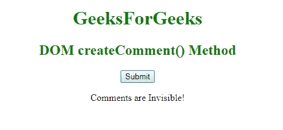

# HTML | DOM createComment()方法

> 原文:[https://www . geesforgeks . org/html-DOM-create comment-method/](https://www.geeksforgeeks.org/html-dom-createcomment-method/)

**createComment()** 方法用于创建带有指定文本的注释节点。此属性用于将文本值设置为字符串类型的参数。

**语法:**

```html
document.createComment( text )
```

**参数:**该方法接受单参数文本，可选。此参数用于保存注释字符串。

**示例:**

```html
<!DOCTYPE html>
<html>
    <head>
        <title>DOM createComment() Method</title>
        <style>
            h1, h2 {
                color:green;
                font-weight:bold;
            }
            body {
                text-align:center;
            }
        </style>
    </head>
    <body>
        <h1>GeeksForGeeks</h1>
        <h2>DOM createComment() Method</h2>
        <button onclick="geeks()">Submit</button>
        <p id="sudo"></p>
        <script>
            function geeks() {
                var c = document.createComment("GFG comments");
                document.body.appendChild(c);
                var x = document.getElementById("sudo");
                x.innerHTML = "Comments are Invisible!";
            }
        </script>
    </body>
</html>                    
```

**输出:**


**支持的浏览器:**T2 DOM createComment()方法属性支持的浏览器如下:

*   谷歌 Chrome
*   微软公司出品的 web 浏览器
*   火狐浏览器
*   歌剧
*   旅行队