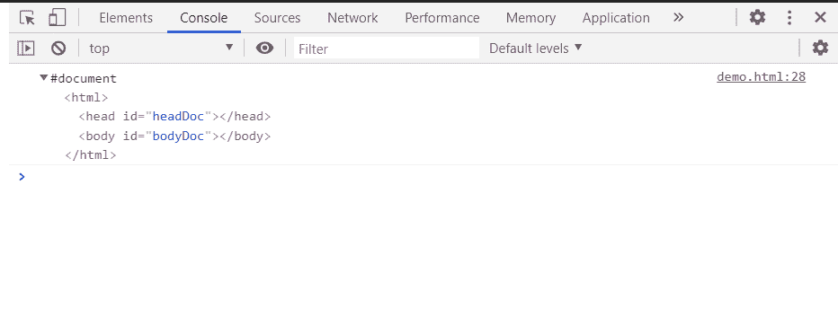

# HTML DOM createDocument()方法

> 原文:[https://www . geesforgeks . org/html-DOM-create document-method/](https://www.geeksforgeeks.org/html-dom-createdocument-method/)

**方法实现创建文档()**方法用于创建和返回文档。

**语法:**

```html
var doc = document.implementation.createDocument(*namespaceURI*, *qualifiedNameStr*, *docType*);

```

**参数:**

*   **namespaceURI:** 它是一个包含要创建的文档的命名空间 URI 的 DOMString，如果文档不属于某个命名空间，则为 null。
*   **qualifiedNameStr:** 是包含限定名的 DOMString
*   **单据类型** ***(*** **可选):**是要创建单据的单据类型，默认值为空。

**返回值:** 该函数成功返回多文档对象。

**示例:**在本例中，我们将使用此方法创建文档。

```html
<!DOCTYPE HTML> 
<html>  
<head>
    <meta charset="UTF-8">
    <title>createDocument() method</title>
</head>   

<body style="text-align:center;">
    <h1 style="color:green;">  
     GeeksforGeeks
    </h1> 
    <p id="a"> 
    HTML | DOM createDocument() method
    </p>

    <button onclick = "Geeks()">
    Click Here
    </button>
    <script> 
        function Geeks(){
            var doc = document.implementation.createDocument (
'http://www.w3.org/1999/xhtml', 'html', null);
            var head = document.createElementNS(
'http://www.w3.org/1999/xhtml', 'head');
            head.setAttribute('id', 'headDoc');
            doc.documentElement.appendChild(head);
            var body = document.createElementNS(
'http://www.w3.org/1999/xhtml', 'body');
            body.setAttribute('id', 'bodyDoc');
            doc.documentElement.appendChild(body);
            console.log(doc)
        }
  </script> 
</body>   
</html>
```

**输出:**

**按钮点击前:**


**按钮点击后:**



**支持的浏览器:**

*   谷歌 Chrome
*   边缘
*   火狐浏览器
*   旅行队
*   歌剧
*   微软公司出品的 web 浏览器