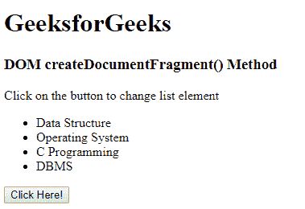
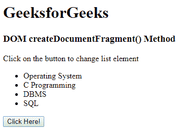

# html | DOM create document fragment()方法

> 原文:[https://www . geesforgeks . org/html-DOM-createdocumentfragment-method/](https://www.geeksforgeeks.org/html-dom-createdocumentfragment-method/)

HTML DOM 中的 **createDocumentFragment()** 方法用于创建文档片段，该文档片段对于文档内容的更改(如删除、修改或添加新节点)非常有用。该方法创建文档片段，然后将文档的元素附加到文档片段中，并根据需要进行更改。最后，将文档片段追加到文档中。这是一种安全的方法，因此可以防止破坏 DOM 结构。

**语法:**

```html
document.createDocumentFragment()
```

**参数:**该方法不接受任何参数。

**返回值:**返回创建的 DocumentFragment 节点。

**示例:**

```html
<!DOCTYPE html>
<html>

<head>

    <!--script to delete first child of
    the list, and modify it -->
    <script>
        function myGeeks() {
            var doc = document.createDocumentFragment();
            doc.appendChild
                (document.getElementsByTagName("li")[0]);
            doc.childNodes[0].childNodes[0].nodeValue =
                                                    "SQL";
            document.getElementsByTagName
                                ("ul")[0].appendChild(doc);
        }
    </script>
</head>

<body>
    <h1>GeeksforGeeks<h1/>

    <h3>
        DOM createDocumentFragment() Method
    </h3>

    <p>
        Click on the button to change
        list element
    </p>

    <ul>
        <li>Data Structure</li>
        <li>Operating System</li>
        <li>C Programming</li>
        <li>DBMS</li>
    </ul>

    <button onclick = "myGeeks()">
        Click Here!
    </button>
</body>

</html>                    
```

**输出:**
**之前点击按钮:**

**之后点击按钮:**


**支持的浏览器:**以下是 *DOM createDocumentFragment()方法*支持的浏览器:

*   谷歌 Chrome
*   微软公司出品的 web 浏览器
*   火狐浏览器
*   歌剧
*   旅行队