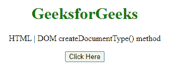

# HTML DOM createDocumentType()方法

> 原文:[https://www . geesforgeks . org/html-DOM-createdocumenttype-method/](https://www.geeksforgeeks.org/html-dom-createdocumenttype-method/)

**强制实现创建文档类型()方法**返回一个文档类型对象，该对象可以与**强制实现创建文档()**方法一起使用，也可以放入文档中。

**语法:**

> var doctype = document . implementation . createdocumenttype(qualifiedNameStr，publicId，system id)；

**参数:**

*   **qualifiedNameStr:** 是包含限定名的 DOMString
*   **publicId:** 是一个包含 PUBLIC 标识符的 DOMString。
*   **systemId:** 它是一个包含系统标识符的 DOMString。

**返回值:**该函数返回 DOMDocumentType 节点。

**示例:**在本例中，我们将使用此方法创建文档类型。

```html
</html>
<!DOCTYPE HTML> 
<html>  
<head>
    <meta charset="UTF-8">
    <title>createDocumentType() method</title>
</head>   

<body style="text-align:center;">
    <h1 style="color:green;">  
     GeeksforGeeks
    </h1> 
    <p id="a"> 
    HTML | DOM createDocumentType() method
    </p>

    <button onclick = "Geeks()">
    Click Here
    </button>
    <script> 
        function Geeks(){
            var dt = 
document.implementation.createDocumentType(
'svg:svg', null, 
'http://www.w3.org/Graphics/SVG/1.1/DTD/svg11.dtd');
            console.log(dt);
            var doc = document.implementation.createDocument (
'http://www.w3.org/1999/xhtml', 'html', dt);
            var head = document.createElementNS(
'http://www.w3.org/1999/xhtml', 'head');
            head.setAttribute('id', 'headDoc');
            doc.documentElement.appendChild(head);
            var body = document.createElementNS(
'http://www.w3.org/1999/xhtml', 'body');
            body.setAttribute('id', 'bodyDoc');
            doc.documentElement.appendChild(body);
            console.log(doc);
        }
  </script> 
</body>   
</html>
```

**输出:**

**按钮点击前:**



**按钮点击后:**已创建文档，在控制台可以看到文档类型。


**支持的浏览器:**

*   谷歌 Chrome
*   边缘
*   火狐浏览器
*   旅行队
*   歌剧
*   微软公司出品的 web 浏览器