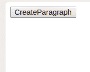
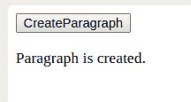
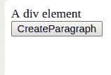
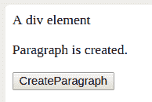

# HTML | DOM createElement()方法

> 原文:[https://www . geesforgeks . org/html-DOM-create element-method/](https://www.geeksforgeeks.org/html-dom-createelement-method/)

在 HTML 文档中， **document.createElement()** 是用来创建 HTML 元素的方法。如果无法识别指定的元素名称，则会创建使用元素名称指定的元素或创建未知的 HTML 元素。

**语法**

```
var element = document.createElement("elementName");

```

在上面的语法中，elementName 作为参数传递。元素名称指定创建的元素的类型。创建的元素的节点名被初始化为元素名值。document.createElement()返回新创建的元素。

**示例 1:本示例说明如何创建< p >元素。**

**输入:**

```
<!DOCTYPE html>
<html>

<head>
    <script>
        function createparagraph() {
            var x = document.createElement("p");
            var t = 
                document.createTextNode("Paragraph is created.");
            x.appendChild(t);
            document.body.appendChild(x);
        }
    </script>
</head>

<body>
    <button onclick="createparagraph()">CreateParagraph</button>
</body>

</html>                    
```

**输出:**
**初始:**


**按下创建段落按钮后:**


**说明:**

*   首先使用 document.createElement()创建一个

    元素。

*   使用 document.createTextNode()创建文本节点。
*   现在，使用 appendChild()将文本追加到

    中。

*   使用 appendChild()将

    附加到

    。

**示例 2:本示例说明如何创建一个< p >元素并将其附加到一个< div >元素。** 
**输入:**

```
<!DOCTYPE html>
<html>

<head>
    <script>
        function createparagraph() {
            var x = document.createElement("p");
            var t = 
                document.createTextNode("Paragraph is created.");
            x.appendChild(t);
            document.getElementById("divid").appendChild(x);
        }
    </script>
</head>

<body>
    <div id="divid"> A div element</div>
    <button onclick="createparagraph()">CreateParagraph</button>
</body>

</html>
```

**输出:**

**最初:**


**按下【创建段落】按钮后:**

**支持的浏览器:**DOM createElement()方法
支持的浏览器如下:

*   谷歌 Chrome
*   微软公司出品的 web 浏览器
*   火狐浏览器
*   歌剧
*   旅行队