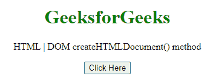
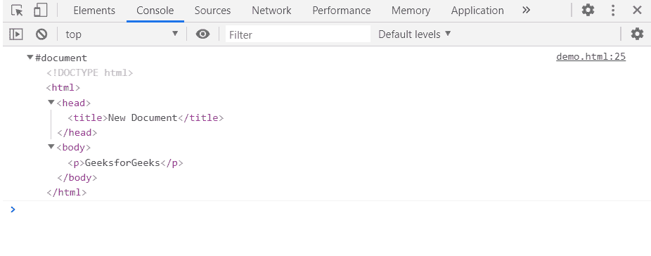

# HTML DOM createHTMLDocument()方法

> 原文:[https://www . geesforgeks . org/html-DOM-createhtml document-method/](https://www.geeksforgeeks.org/html-dom-createhtmldocument-method/)

**方法实现创建 HTML 文档()**方法用于创建一个新的 HTML 文档。

**语法:**

```html
newDoc = document.implementation.createHTMLDocument(title);
```

**参数:**

*   **标题(可选):**它是一个包含要用于新 HTML 文档的标题的 DOMString。

**返回值:**该函数返回已创建的 HTML 文档。

**示例:**在本例中，我们将使用此方法创建一个 HTML 文档。

```html
<!DOCTYPE HTML> 
<html>  
<head>
    <meta charset="UTF-8">
    <title>createHTMLDocument() method</title>
</head>   

<body style="text-align:center;">
    <h1 style="color:green;">  
     GeeksforGeeks
    </h1> 
    <p id="a"> 
    HTML | DOM createHTMLDocument() method
    </p>

    <button onclick = "Geeks()">
    Click Here
    </button>
    <script> 
        function Geeks(){
            var doc = 
document.implementation.createHTMLDocument("New Document");
            var p = doc.createElement("p");
            p.innerHTML = "GeeksforGeeks";
            doc.body.appendChild(p);
            console.log(doc);
        }
  </script> 
</body>   
</html>
```

**输出:**

**按钮点击前:**



**按钮点击后:**在控制台可以看到创建的文档。



**支持的浏览器:**

*   谷歌 Chrome
*   边缘
*   火狐浏览器
*   旅行队
*   歌剧
*   微软公司出品的 web 浏览器