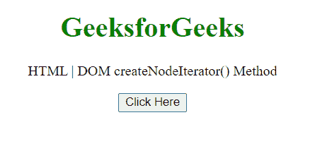
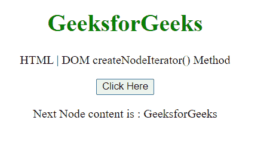
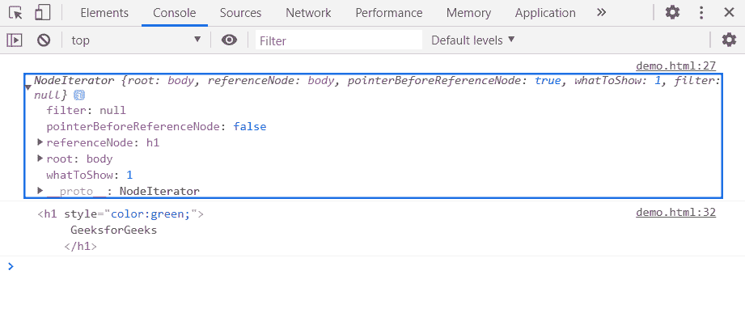

# HTML DOM createNodeIterator()方法

> 原文:[https://www . geesforgeks . org/html-DOM-createnodeiterator-method/](https://www.geeksforgeeks.org/html-dom-createnodeiterator-method/)

方法用于创建一个节点迭代器，因此使用该节点迭代器我们可以对节点进行迭代。

**语法:**

> const nodeIterator = document . createnodeiterator(*root*[， *whatToShow* [，*filter*])；

**参数:**

*   **根** ***:*** 开始节点迭代器遍历的根节点。
*   **whatoshow(可选):**这是一个可选参数，表示通过组合 NodeFilter 的常量属性创建的位掩码。以下是无符号常量的可能值。

<figure class="table">

| **恒定** | **返回值** | **常量描述** |
| NodeFilter。全部显示 | one | 显示所有节点。 |
| NodeFilter。显示评论 | One hundred and twenty-eight | 显示注释节点。 |
| NodeFilter。SHOW_DOCUMENT | Two hundred and fifty-six | 显示文档节点。 |
| NodeFilter。SHOW_DOCUMENT_FRAGMENT | One thousand and twenty-four | 显示文档片段节点。 |
| NodeFilter。显示文档类型 | Five hundred and twelve | 显示文档类型节点。 |
| NodeFilter。SHOW_ELEMENT | one | 显示元素节点。 |
| NodeFilter。显示处理指令 | Sixty-four | 显示处理指令节点。 |
| NodeFilter.SHOW_TEXT | four

 | 显示文本节点。 |

</figure>

*   **过滤器(可选):**实现节点过滤器接口的对象。Exp，NodeFilter。FILTER_ACCEPT。

**返回值:**这个方法返回一个节点迭代器。

**示例:**在本例中，我们将使用此方法创建一个节点迭代器，并将使用 nextNode()方法进行迭代。

```html
<!DOCTYPE HTML> 
<html>  
<head>
    <meta charset="UTF-8">
    <title>HTML | DOM createNodeIterator() Method
    </title>
</head>   

<body style="text-align:center;">
    <h1 style="color:green;">  
     GeeksforGeeks
    </h1> 
    <p> 
HTML | DOM createNodeIterator() Method
    </p>

    <button onclick = "Geeks()">
    Click Here
    </button>
    <p id="a"></p>
    <script> 
        var a = document.getElementById("a");
        function Geeks(){
           const nodeIterator = document.createNodeIterator(
                document.body,
                NodeFilter.SHOW_ELEMENT
                )
           console.log(nodeIterator)

            let nextNode=nodeIterator.nextNode();
            nextNode=nodeIterator.nextNode();
            a.innerHTML =
'Next Node content is : '+nextNode.textContent;
            console.log(nextNode);
}
</script>
</body>
</html>
```

**输出:**

**点击按钮前:**



**点击按钮后:**



**在控制台中:**在控制台中，可以看到节点迭代器和下一个节点。



**支持的浏览器:**

*   谷歌 Chrome
*   边缘
*   火狐浏览器
*   旅行队
*   歌剧
*   微软公司出品的 web 浏览器