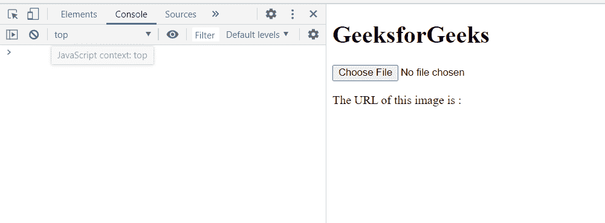
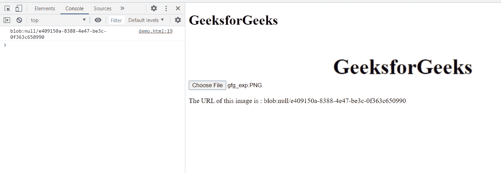
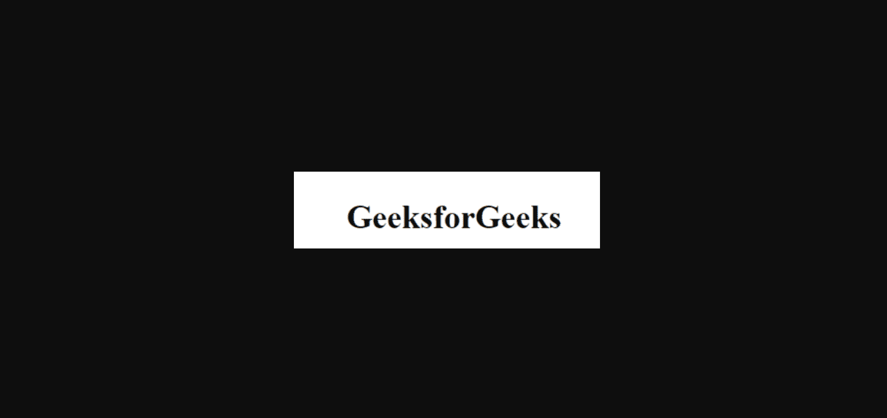

# HTML DOM createObjectURL()方法

> 原文:[https://www . geesforgeks . org/html-DOM-createobjecturl-method/](https://www.geeksforgeeks.org/html-dom-createobjecturl-method/)

**createObjectURL()** **方法**创建一个包含 URL 的 **DOMString，该 URL 表示方法参数中给定的对象。新的对象网址表示指定的文件对象或斑点对象。**

**注意:**URL 生存期与创建它的文档相关联。

**语法:**

```html
const url = URL.createObjectURL(object);
```

**参数:**

*   **对象:**要为其创建对象网址的文件、图像或任何其他媒体源对象。

**返回值:**一个包含该对象的对象网址的**字符串**。

**示例:**在本例中，我们将使用此方法为图像对象创建一个对象 URL。

```html
<!DOCTYPE html>
<html>
<head>
  <meta charset="utf-8">
  <title>URL.createObjectURL example</title>
</head>
<body>
  <h1>GeeksforGeeks</h1>
  <input type="file">
  
  <p class="p">The URL of this image is : </p>
</body>
<script>
    var Element = document.querySelector('input');
    var img = document.querySelector('img');
    Element.addEventListener('change', function() {
      var url = URL.createObjectURL(Element.files[0]);
      img.src = url;
      console.log(url);
      var d=document.querySelector(".p");
      d.textContent+=url;
});
</script>
</html>
```

**输出:**我们将从本地存储中选择一个图像，然后将创建该对象的 URL。

**选择图像前:**



**选择图像后:**



**在** **新标签中检查创建的网址:**



**支持的浏览器:**

*   谷歌 Chrome
*   边缘
*   火狐浏览器
*   旅行队
*   歌剧