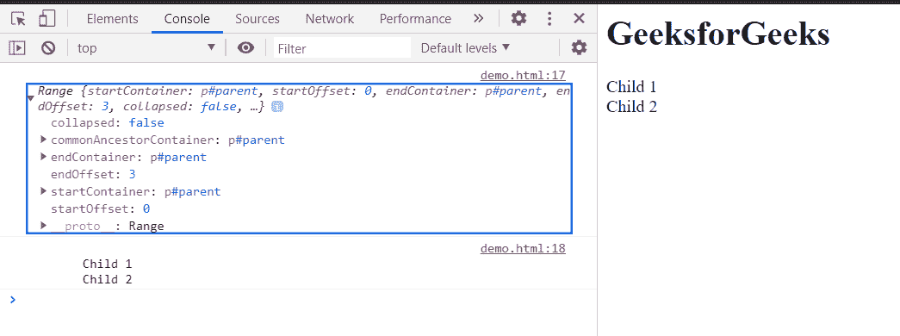

# HTML DOM createRange()方法

> 原文:[https://www.geeksforgeeks.org/html-dom-createrange-method/](https://www.geeksforgeeks.org/html-dom-createrange-method/)

**createRange()** 方法为文档创建一个新的 Range 对象。

**语法:**

```html
range = document.createRange();
```

**参数:**此方法不接受任何参数。

**返回值:**此方法返回**创建的范围**。

**示例:**在本例中，我们将使用此方法创建一个范围，一个范围不应为空，因此我们将使用 setEnd()和 setStart()方法在该范围内制作起点和终点。

## 超文本标记语言

```html
<!DOCTYPE html>
<html>

<body>
    <h1>GeeksforGeeks</h1>
    <p id="parent">
        Child 1<br>
        Child 2<br>
    </p>

    <script>
        const example = document.getElementById('parent');
        const range = document.createRange();
        range.setStart(example, 0);
        range.setEnd(example, 3);
        console.log(range);
        console.log(range.toString());
    </script>
</body>

</html>
```

**输出:**在控制台中，可以看到创建的范围。



**支持的浏览器:**

*   谷歌 Chrome
*   边缘
*   火狐浏览器
*   旅行队
*   歌剧