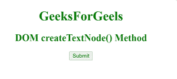
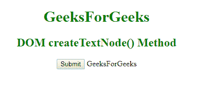

# HTML | DOM createTextNode()方法

> 哎哎哎:# t0]https://www . geeksforgeeks . org/html-DOM-create text node-method/

**createTextNode()** 方法用于创建包含元素节点和文本节点的文本节点。它用于向元素提供文本。此方法包含文本值作为字符串类型的参数。
**语法:**

```html
document.createTextNode( text )
```

**参数:**该方法接受单参数*文本*，为必选项。用于指定文本节点的文本。
**例:**

## 超文本标记语言

```html
<!DOCTYPE html>
<html>
    <head>
        <title>DOM createTextNode() Method</title>
        <style>
            h1, h2 {
                color:green;
                font-weight:bold;
            }
            body {
                text-align:center;
            }
        </style>
    </head>
    <body>
        <h1>GeeksForGeels</h1>
        <h2>DOM createTextNode() Method</h2>
        <button onclick="geeks()">Submit</button>
        <script>
            function geeks() {
                var x =
                    document.createTextNode("GeeksForGeeks");
                document.body.appendChild(x);
            }
        </script>
    </body>
</html>                   
```

**输出:**

**点击按钮前:**



**点击按钮后:**



**支持的浏览器:**T2 DOM createTextNode()方法支持的浏览器如下:

*   谷歌 Chrome
*   微软公司出品的 web 浏览器
*   火狐浏览器
*   歌剧
*   旅行队