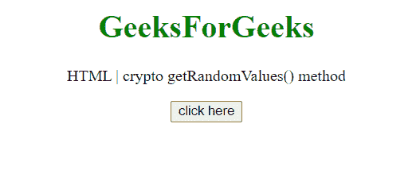
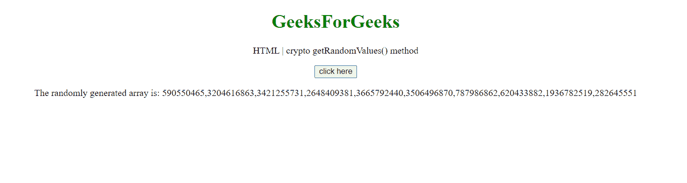

# HTML DOM crypto . getrandomvalues()方法

> 原文:[https://www . geesforgeks . org/html-DOM-crypto-getrandomvalues-method/](https://www.geeksforgeeks.org/html-dom-crypto-getrandomvalues-method/)

通过**c****rypto getRandomValues()**方法，您可以获得加密随机值。作为此方法的参数给出的数组用加密随机数填充。

**语法:**

```html
var a = window.crypto.getRandomValues(*Array*);
```

**参数:**

*   **数组:**基于整数的数组，可以是 Int8Array、UInt8Array、Int16Array、Uint16Array、Int32Array 或 Uint32Array。使用此方法后，数组中的所有元素都将被随机数覆盖。

**返回值:**该方法传递的数组被覆盖返回。

**示例:**本示例使用 getRandomValues()方法生成大小为 10 的随机 Uint32Array。

```html
<!DOCTYPE HTML> 
<html>  
<head>
    <title>crypto getRandomValues() method</title>
</head>   
<body style="text-align:center;">
    <h1 style="color:green;">  
        GeeksForGeeks  
    </h1> 
    <p> 
    HTML | crypto getRandomValues() method    
    </p>
    <button onclick = "Geeks();">
    click here
    </button>
    <p id="arr"> 
    </p>       
    <script> 
        var arr = document.getElementById("arr");
        function Geeks() {
            var array = new Uint32Array(10);
            a = window.crypto.getRandomValues(array);
            console.log(a);
            arr.innerHTML = 
           "The randomly generated array is: "+a;
        } 
    </script> 
</body>   
</html>
```

**输出:**

**点击按钮前:**



**点击按钮后:**



**支持的浏览器:**

*   谷歌 Chrome
*   边缘
*   火狐浏览器
*   旅行队
*   歌剧
*   微软公司出品的 web 浏览器