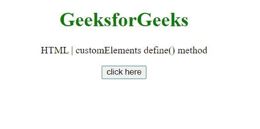
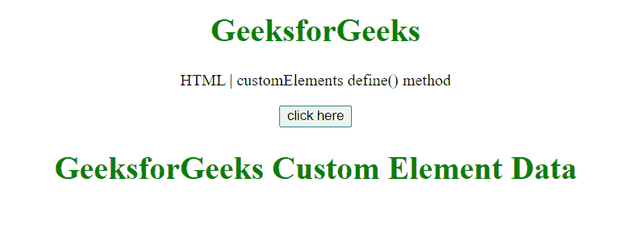

# HTML DOM customElements define()方法

> 原文:[https://www . geesforgeks . org/html-DOM-customelements-define-method/](https://www.geeksforgeeks.org/html-dom-customelements-define-method/)

**自定义元素** **定义()** **方法**用于定义新的自定义元素。可以创建两种类型的自定义元素:

*   **自主定制元素:**这些元素不继承内置 HTML 元素。
*   **定制的内置元素:**这些元素继承自内置 HTML 元素。

**语法:**

```html
customElements.define( name, constructor, options );
```

**参数:**

*   **名称:**指定新自定义元素的名称。自定义元素的名称必须包含连字符。
*   **构造函数:**指定新自定义元素的构造函数。
*   **选项:**指定控制元素定义方式的对象。这是一个可选参数。

**返回值:**此方法返回 void。

**示例:**在本例中，定义了一个自定义元素，名为**<gfg-custom-element>**，构造函数名为 **CustomEl** 使用此方法。

## 超文本标记语言

```html
<!DOCTYPE HTML>
<html>

<body style="text-align:center;">
    <h1 style="color:green;">
        GeeksforGeeks
    </h1>

    <p>
        HTML | customElements define() method
    </p>

    <button onclick="Geeks();">
        click here
    </button>

    <p id="arr"></p>

    <script>
        var arr =
            document.getElementById("arr");

        // Function to define the element
        function Geeks() {
            class CustomEl extends HTMLElement {
                constructor() {
                    super();
                    this.attachShadow({ mode: 'open' });
                    this.shadowRoot.innerHTML = `
            <h1 style="color:green;">  
            GeeksforGeeks Custom
            Element Data
                </h1>
            `;
                }
            }

            // Use the define() method to define
            // a new element
            window.customElements.define(
                'gfg-custom-element', CustomEl);
        } 
    </script>
    <gfg-custom-element></gfg-custom-element>
</body>

</html>
```

**输出:**

*   **点击按钮前:**

    

*   **点击按钮后:**

    

**支持的浏览器:**

*   谷歌 Chrome 66.0
*   Edge 79.0
*   Firefox 63.0
*   Safari 10.1
*   Opera 53.0