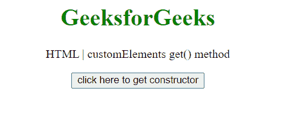
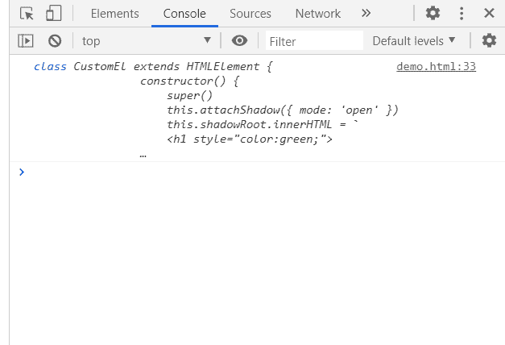

# HTML DOM customElements get()方法

> 原文:[https://www . geesforgeks . org/html-DOM-customelements-get-method/](https://www.geeksforgeeks.org/html-dom-customelements-get-method/)

customElements **get()** 方法返回用于先前定义的自定义元素的构造函数。

**语法:**

```html
*constructor* = customElements.get('custom-element-*name'*);
```

**参数:**

*   **名称:**要返回其构造函数的自定义元素的名称。

**返回值:**该方法返回自定义元素的**构造函数**，如果没有同名的自定义元素定义，则返回未定义。

**示例:**在这个示例中，我们将定义一个自定义元素，然后使用这个方法获取它的构造函数。

```html
<!DOCTYPE HTML> 
<html>  
<head>
    <title>get() method</title>
</head>   
<body style="text-align:center;">
    <h1 style="color:green;">  
        GeeksforGeeks  
    </h1> 
    <p> 
    HTML | customElements get() method
    </p>
    <button onclick = "Geeks();">
    click here to get constructor
    </button>
    <p id="a"> 
    </p>       
    <script> 
        var a = document.getElementById("a");
        function Geeks() {
            class CustomEl extends HTMLElement {
                  constructor() {
                    super()
                    this.attachShadow({ mode: 'open' })
                    this.shadowRoot.innerHTML = `
                      <h1 style="color:green;">  
                        GeeksforGeeks Custom Element Data
                    </h1>
                    `
                      }
                }
window.customElements.define('gfg-custom-element', CustomEl);
console.log(customElements.get('gfg-custom-element'));
        } 

    </script> 
</body>   
</html>
```

**输出:**

**点击按钮前:**



**点击按钮后:**在控制台中，可以看到构造器。



**支持的浏览器:**

*   谷歌 Chrome
*   边缘
*   火狐浏览器
*   旅行队
*   歌剧