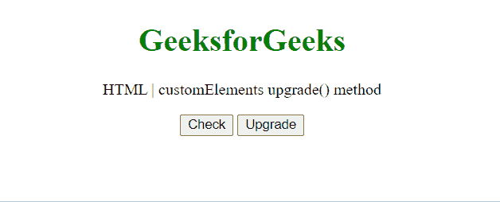

# HTML DOM customElements 升级()方法

> 原文:[https://www . geesforgeks . org/html-DOM-customelements-upgrade-method/](https://www.geeksforgeeks.org/html-dom-customelements-upgrade-method/)

customElements**upgrade()**方法升级节点子树中文档的所有包含阴影的自定义元素，甚至在它们连接到主文档之前。

**语法:**

```html
customElements.upgrade(*root*);
```

**参数:**

*   **根:** 一个节点实例，包含要升级的包含阴影的后代元素。

**返回值:**此方法返回 void。

**示例:**

## 超文本标记语言

```html
<!DOCTYPE HTML>
<html>

<body style="text-align:center;">
    <h1 style="color:green;">
        GeeksforGeeks
    </h1>

    <p>
        HTML | customElements upgrade() method
    </p>

    <button onclick="Geeks()">
        Check
    </button>

    <button onclick="upg()">Upgrade</button>

    <p id="a"></p>

    <script>
        var a = document.getElementById("a");

        const el = document
            .createElement("gfg-custom-element");

        class CustomEl extends HTMLElement {
            constructor() {
                super()
                this.attachShadow({ mode: 'open' })
                this.shadowRoot.innerHTML = `
                      <h1 style="color:green;">  
                        GeeksforGeeks Custom Element Data
                    </h1>
                    `
            }
        }
        window.customElements.define(
                'gfg-custom-element', CustomEl);

        function Geeks() {
            a.innerHTML = "Upgraded : " 
                + (el instanceof CustomEl);
        }
        function upg() {
            customElements.upgrade(el);
        }
    </script>
</body>

</html>
```

**输出:**



**支持的浏览器:**

*   谷歌 Chrome
*   边缘
*   火狐浏览器
*   旅行队
*   歌剧