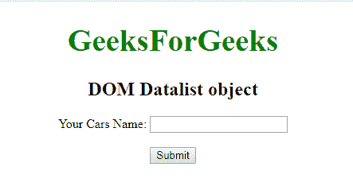
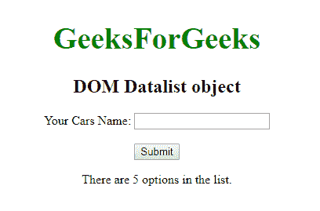
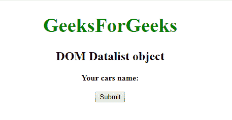
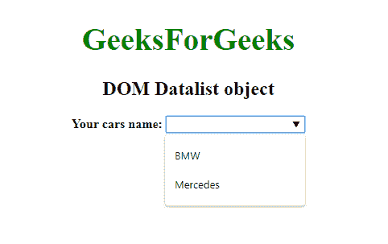

# HTML | DOM 数据列表对象

> 原文:[https://www.geeksforgeeks.org/html-dom-datalist-object/](https://www.geeksforgeeks.org/html-dom-datalist-object/)

**DOM 数据列表对象**用于表示 HTML <数据列表>元素。数据列表元素由 **getElementById()** 访问。
**属性:**它有一个 **'** [**选项'**](https://www.geeksforgeeks.org/html-dom-datalist-options-collection/?ref=rp) 属性，用于返回数据列表中所有选项值的集合。
**语法:**

```html
document.getElementById("gfg"); 
```

其中“gfg”是分配给**“数据列表”**标签的标识。
**示例-1:**

## 超文本标记语言

```html
<!DOCTYPE html>
<html>

<body>
    <center>
        <h1 style="color:green;font-size:39px;">
          GeeksForGeeks
        </h1>

        <h2>DOM Datalist object</h2>

    <form>
        <label>Your Cars Name: </label>
        <input list="gfg">
        <datalist id="cars">
            <option value="BMW" />
            <option value="Bentley" />
            <option value="Mercedes" />
            <option value="Audi" />
            <option value="Volkswagen" />
        </datalist>
    </form>

    <br>
    <button onclick="myGeeks()">Submit</button>

    <p id="sudo"></p>

    <script>
        function myGeeks() {
            var g =
            document.getElementById("gfg").options.length;

            document.getElementById("sudo").innerHTML =
              "There are " + g + " options in the list.";
        }
    </script>
</center>

</body>

</html>
```

**输出:**
**点击按钮前:**



**点击按钮后:**



**示例-2:**

## 超文本标记语言

```html
<!DOCTYPE html>
<html>

<body>
    <center>
        <h1 style="color:green;font-size:39px;">
          GeeksForGeeks
        </h1>

        <h2>DOM Datalist object</h2>

        <form id="GFG">
            <b><label>Your cars name:</label></b>
        </form>
        <br>

        <button onclick="myGeeks()">Submit</button>

        <script>
            function myGeeks() {
                var g = document.createElement("INPUT");
                g.setAttribute("list", "cars");
                document.getElementById("GFG").appendChild(g);

                var f = document.createElement("DATALIST");
                f.setAttribute("id", "cars");
                document.getElementById("GFG").appendChild(f);

                var w = document.createElement("OPTION");
                w.setAttribute("value", "BMW");
                document.getElementById("cars").appendChild(w);

                var x = document.createElement("OPTION");
                x.setAttribute("value", "Mercedes");
                document.getElementById("cars").appendChild(x);
            }
        </script>
    </center>

</body>

</html>
```

**输出:**
**点击按钮前:**



**点击按钮后:**



**支持的浏览器:****DOM Datalist 对象**支持的浏览器如下:

*   谷歌 Chrome
*   微软公司出品的 web 浏览器
*   火狐浏览器
*   歌剧
*   旅行队