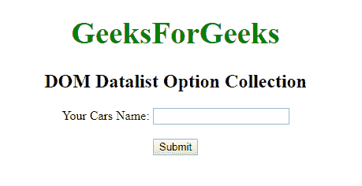
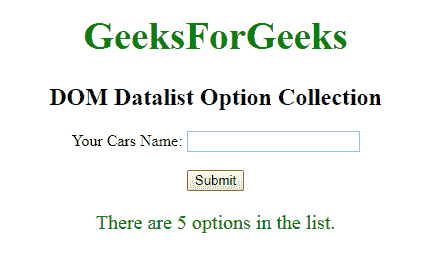
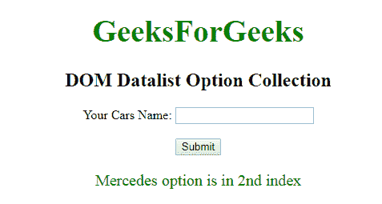

# HTML | DOM 数据列表选项集合

> 原文:[https://www . geesforgeks . org/html-DOM-datalist-options-collection/](https://www.geeksforgeeks.org/html-dom-datalist-options-collection/)

**数据列表选项集合**用于**设置**或**返回**数据列表中所有选项值的集合。集合中的元素按排序顺序排列。

**语法:**

```html
datalistObject.options
```

**属性:**

*   **长度:**用于返回集合中多个<选项>元素。它是只读属性。

**方法:**DOM 选项集合包含三种方法，如下所示:

*   **【索引】:**用于返回所选索引的元素。索引值从 0 开始。如果索引值超出范围，则返回空值。
*   **项(索引):**用于返回所选索引的<选项>元素。索引值从 0 开始。如果索引值超出范围，则返回空值。
*   **namedItem(id):** 用于返回集合中给定 id 属性的元素。如果 id 无效，它将返回 NULL。

**示例-1:** 返回选项长度值。

```html
<!DOCTYPE html>
<html>

<body>
    <center>
        <h1 style="color:green;font-size:39px;"> 
        GeeksForGeeks 
        </h1>

        <h2>DOM Datalist Option Collection</h2>

        <form>
            <label>Your Cars Name: </label>
            <input list="gfg">
            <datalist id="cars">
                <option value="BMW" />
                <option value="Bentley" />
                <option value="Mercedes" />
                <option value="Audi" />
                <option value="Volkswagen" />
            </datalist>
        </form>

        <br>
        <button onclick="myGeeks()">Submit</button>

        <p id="sudo" style="font-size:20px;color:green;"></p>

        <script>
            function myGeeks() {

                // Return length of option.
                var g =
                 document.getElementById(
                   "cars").options.length;

                document.getElementById("sudo").innerHTML =
                    "There are " + g + " options in the list.";
            }
        </script>
    </center>

</body>

</html>
```

**输出:**

**点击按钮前:**


**点击按钮后:**


**示例-2:** 返回特定索引的选项值。

```html
<!DOCTYPE html>
<html>

<body>
    <center>
        <h1 style="color:green;font-size:39px;"> 
        GeeksForGeeks 
        </h1>

        <h2>DOM Datalist Option Collection</h2>

        <form>
            <label>Your Cars Name: </label>
            <input list="gfg">
            <datalist id="cars">
                <option value="BMW" />
                <option value="Bentley" />
                <option value="Mercedes" />
                <option value="Audi" />
                <option value="Volkswagen" />
            </datalist>
        </form>

        <br>
        <button onclick="myGeeks()">
          Submit
      </button>

        <p id="sudo" 
           style="font-size:20px;color:green;">
      </p>

        <script>
            function myGeeks() {

                // Return the value of index 2.
                var g =
                document.getElementById("cars").options[2].value;

                document.getElementById("sudo").innerHTML =
                    g + " option is in 2nd index";
            }
        </script>
    </center>

</body>

</html>
```

**输出:**

**点击按钮前:**


**点击按钮后:**


**支持的浏览器:**T2 DOM 数据列表选项集合属性支持的浏览器如下:

*   谷歌 Chrome
*   微软公司出品的 web 浏览器
*   火狐浏览器
*   歌剧
*   旅行队