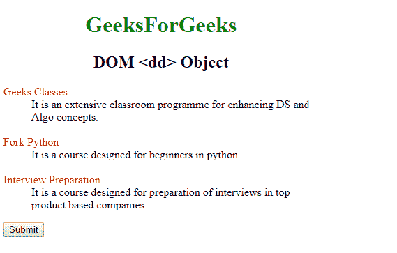
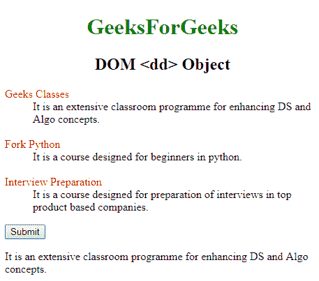
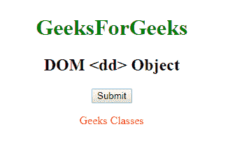
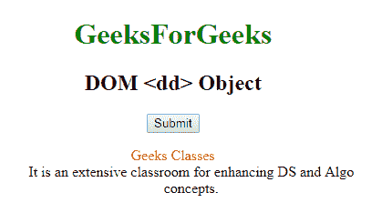

# HTML | DOM DD 对象

> 原文:[https://www.geeksforgeeks.org/html-dom-dd-object/](https://www.geeksforgeeks.org/html-dom-dd-object/)

**DOM DD 对象**用于表示 [HTML < DD >元素](https://www.geeksforgeeks.org/html-br-tag/)。DD 元素由 getElementById()访问。

**语法:**

```html
document.getElementById("ID");

```

其中“id”是分配给**“DD”**标签的 ID。

**示例-1:**

```html
<!DOCTYPE html>
<html>

<head>
    <title>HTML dd Tag</title>
    <style>
        h1 {
            color: green;
        }

        h1,
        h2 {
            text-align: center;
        }

        body {
            width: 70%;
        }

        dt {
            color: red;
        }
    </style>
</head>

<body>
    <h1>GeeksForGeeks</h1>
    <h2>DOM <dd> Object</h2>
    <dl>
        <dt>Geeks Classes</dt>

        <!-- Assigning id to dd -->
        <dd id="GFG">
          It is an extensive classroom 
          programme for enhancing DS and Algo concepts.
        </dd>
        <br>

        <dt>Fork Python</dt>
        <dd>
          It is a course designed for beginners in python.
        </dd>
        <br>

        <dt>Interview Preparation</dt>
        <dd>
          It is a course designed for preparation 
          of interviews in top product based companies.
        </dd>
    </dl>

    <button onclick="myGeeks()">
      Submit
    </button>

    <p id="sudo">
    </p>

    <script>
        function myGeeks() {
            <!-- Accessing of dd object. -->
            var g = 
             document.getElementById("GFG").innerHTML;
             document.getElementById("sudo").innerHTML 
            = g;

        }
    </script>
</body>

</html>            
```

**输出:**

**点击按钮前:**


**点击按钮后:**


**示例-2:** 可以使用**文档.创建元素**方法创建 DD 对象。

```html
<!DOCTYPE html>
<html>

<head>
    <title>HTML dd Tag</title>
    <style>
        h1 {
            color: green;
        }

        h1,
        h2 {
            text-align: center;
        }

        body {
            width: 70%;
        }

        dt {
            color: red;
        }
    </style>
</head>

<body>
    <center>
        <h1>GeeksForGeeks</h1>
        <h2>DOM <dd> Object</h2>

        <button onclick="myGeeks()">Submit</button>

        <dl id="GFG">
            <dt>Geeks Classes</dt>
        </dl>
        <script>
            function myGeeks() {
                var g = document.createElement("DD");
                var f = document.createTextNode(
                    "It is an extensive classroom for" 
                  + " enhancing DS and Algo concepts.");
                g.appendChild(f);

                var w = document.getElementById("GFG");
                w.appendChild(g);
            }
        </script>
    </center>
</body>

</html>
```

**输出:**

**点击按钮前:**


**点击按钮后:**


**支持的浏览器:****DOM DD 对象**支持的浏览器如下:

*   谷歌 Chrome
*   微软公司出品的 web 浏览器
*   火狐浏览器
*   歌剧
*   旅行队