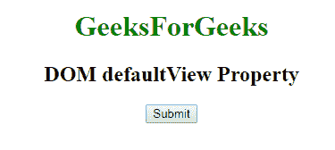
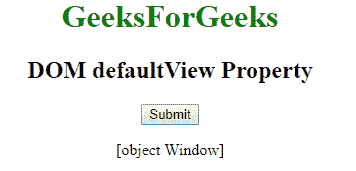
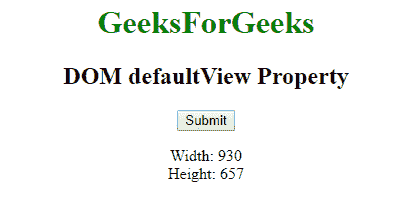

# HTML | DOM 默认视图属性

> 原文:[https://www . geesforgeks . org/html-DOM-default view-property/](https://www.geeksforgeeks.org/html-dom-defaultview-property/)

HTML 中的 **DOM defaultView 属性**用于返回文档窗口对象。窗口对象是浏览器中打开的窗口。

**语法:**

```html
document.defaultView 
```

**返回值:**用于返回当前窗口对象。

**例 1:**

```html
<!DOCTYPE html>
<html>
    <head>
        <title>
            DOM defaultView Property
        </title>
    </head>

    <body style = "text-align:center">

        <h1 style = "color:green">GeeksForGeeks</h1>
        <h2>DOM defaultView Property </h2>

        <button onclick = "geeks()">Submit</button>

        <p id="sudo"></p>

        <script>
            function geeks() {
                var doc = document.defaultView;
                document.getElementById("sudo").innerHTML = doc;
            }
        </script>

    </body>
</html>                    
```

**输出:**
**点击按钮前:**

**点击按钮后:**


**示例 2:** 本示例用于返回窗户的宽度和高度。

```html
<!DOCTYPE html>
<html>
    <head>
        <title>
            DOM defaultView Property
        </title> 
    </head>

    <body>
        <center>
            <h1 style = "color:green;">GeeksForGeeks</h1>
            <h2>DOM defaultView Property </h2>

            <button onclick="Geeks()">Submit</button>

            <p id="sudo"></p>

            <!-- script to find window size -->
            <script>
                function Geeks() {
                    var def_view = document.defaultView;
                    var width = def_view.innerWidth;
                    var height = def_view.innerHeight;
                    document.getElementById("sudo").innerHTML 
                    = "Width: " + width + 
                    "<br>Height: " + height;
                }
            </script>
        </center>
    </body>
</html>                    
```

**输出:**
**点击按钮前:**

**点击按钮后:**


**支持的浏览器:**T2 DOM default view 属性支持的浏览器如下:

*   谷歌 Chrome
*   微软公司出品的 web 浏览器
*   火狐浏览器
*   歌剧
*   旅行队