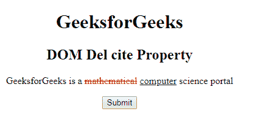
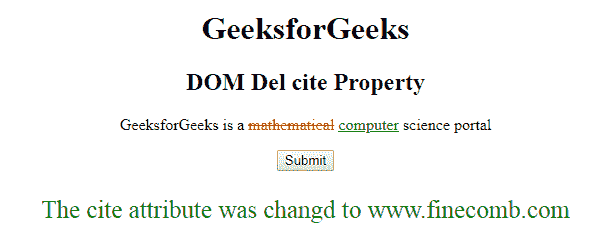

# HTML | DOM del cite Property

> 原文:[https://www.geeksforgeeks.org/html-dom-del-cite-property/](https://www.geeksforgeeks.org/html-dom-del-cite-property/)

HTML DOM 中的 **DOM del cite Property** 用于**设置**或**返回** *一个 **< del >** 元素*的 cite 属性值。cite 属性用于指定文档或消息的 URL，该 URL 表示删除文本的原因。它对任何普通的网页浏览器都没有视觉效果。它只能由屏幕阅读器使用。

**语法:**

*   它返回引用属性。

    ```html
    delObject.cite
    ```

*   它用于设置 cite 属性。

    ```html
    delObject.cite = URL
    ```

**属性值:**

*   **网址:**它指定了文档的网址，该网址定义了文本删除其他先前文本的原因。
    **可能的值有:**

1.  **绝对 URL:** 用于指出其他网站(如 cite ="http://www.w3schools.com ")
2.  **相对 URL:** 用于指出网站内的页面。(如 cite="geeks.htm ")

**返回值:**返回一个代表源文档网址的字符串值。

**示例-1:** 本示例返回引用属性。

```html
<!DOCTYPE html>
<html>

<head>
    <title>
      HTML DOM Del cite Property
  </title>
    <style>
        del {
            color: red;
        }

        ins {
            color: green;
        }
    </style>
</head>

<body style="text-align:center;">
    <h1>
      GeeksforGeeks
  </h1>

    <h2>
      DOM Del cite Property
  </h2>

    <p>
        GeeksforGeeks is a 
      <del id="GFG" 
           cite="www.GeeksForGeeks.com"> 
            mathematical</del> 
      <ins>
        computer</ins> science portal
    </p>

    <button onclick="myGeeks()">
        Submit
    </button>

    <p id="sudo"
       style="Font-size:25px;
              color:green;">
  </p>

    <script>
        function myGeeks() {
            var g =
                document.getElementById("GFG").cite;

            document.getElementById(
              "sudo").innerHTML = g;
        }
    </script>

</body>

</html>
```

**输出:**
**点击按钮前:**


**点击按钮后:**


**示例-2:** 本示例设置引用属性。

```html
<!DOCTYPE html>
<html>

<head>
    <title>
      HTML DOM Del cite Property
  </title>
    <style>
        del {
            color: red;
        }

        ins {
            color: green;
        }
    </style>
</head>

<body style="text-align:center;">
    <h1>GeeksforGeeks</h1>

    <h2>
      DOM Del cite Property
  </h2>

    <p>
        GeeksforGeeks is a
      <del id="GFG"
           cite="www.GeeksForGeeks.com"> 
            mathematical
      </del> 
      <ins>computer</ins> science portal
    </p>

    <button onclick="myGeeks()">
        Submit
    </button>

    <p id="sudo" 
       style="Font-size:25px;
              color:green;">
  </p>

    <script>
        function myGeeks() {
            var g = 
                document.getElementById(
                  "GFG").cite = 
                "www.finecomb.com";

            document.getElementById(
              "sudo").innerHTML = 
              "The cite attribute was changd to " + g;
        }
    </script>

</body>

</html>
```

**输出:**

**点击按钮前:**


**点击按钮后:**


**支持的浏览器:**T2 DOM Del cite 属性支持的浏览器如下:

*   谷歌 Chrome
*   Internet Explorer 10.0 +
*   火狐浏览器
*   歌剧
*   旅行队