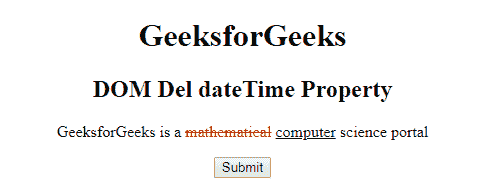
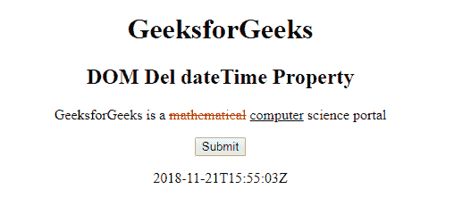
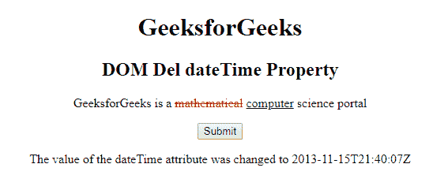

# HTML | DOM del dateTime 属性

> 原文:[https://www . geesforgeks . org/html-DOM-del-datetime-property/](https://www.geeksforgeeks.org/html-dom-del-datetime-property/)

**DOM del dateTime 属性**用于**设置**或**返回 **< del >** 元素的 dateTime 属性的值。此属性用于指定删除文本的日期和时间。日期时间以格式 **YYYY-MM-DDThh:mm:ssTZD** 插入。**

**语法:**

*   它用于返回日期时间属性。

    ```html
    delObject.dateTime
    ```

*   It is used to set the dateTime property.

    ```html
    delObject.dateTime = YYYY -MM-DDThh:mm:ssTZD
    ```

    **属性值:**

    *   **YYYY-MM-DDThh:MM:ssTZD**YYYY-MM-DDThh:MM:ssTZD 指定删除文本的日期和时间

    **说明:**

    *   **YYYY**–年份(如 2009 年)
    *   **月**–月(如 01 代表 1 月)
    *   **日**–一个月中的某一天(例如 08)
    *   **T**–所需的分离器
    *   **hh**–小时(例如晚上 10 点 22 分)
    *   **毫米**–分钟(例如 55)
    *   **ss**–秒(例如 03)
    *   **TZD**–时区指示器(Z 表示祖鲁语，也称为格林威治标准时间)

    **返回值:**返回一个字符串值，代表文本被删除的日期和时间。

    **示例-1:** 本示例返回日期时间属性。

    ```html
    <!DOCTYPE html>
    <html>

    <head>
        <title>
          HTML DOM Del dateTime
      </title>
        <style>
            del {
                color: red;
            }

            ins {
                color: green;
            }
        </style>
    </head>

    <body style="text-align:center;">
        <h1>
          GeeksforGeeks
      </h1>

        <h2>
          DOM Del dateTime Property
      </h2>

        <p>
            GeeksforGeeks is a 
          <del id="GFG" 
               datetime="2018-11-21T15:55:03Z"> 
                mathematical</del> 
          <ins>computer</ins> science portal
        </p>

        <button onclick="myGeeks()">
            Submit
        </button>

        <p id="sudo"></p>

        <script>
            function myGeeks() {
                var g = 
                    document.getElementById(
                      "GFG").dateTime;

                document.getElementById(
                  "sudo").innerHTML = g;
            }
        </script>

    </body>

    </html>
    ```

    **输出:**

    **点击按钮前::**
    

    **点击按钮后::**
    

    **示例-2 :** 本示例设置日期时间属性。

    ```html
    <!DOCTYPE html>
    <html>

    <head>
        <title>
          HTML DOM Del dateTime
      </title>
        <style>
            del {
                color: red;
            }

            ins {
                color: green;
            }
        </style>
    </head>

    <body style="text-align:center;">
        <h1>GeeksforGeeks</h1>

        <h2>
          DOM Del dateTime Property
      </h2>

        <p>
            GeeksforGeeks is a 
          <del id="GFG" 
               datetime="2018-11-21T15:55:03Z"> 
                mathematical</del> 
          <ins>computer</ins> science portal
        </p>

        <button onclick="myGeeks()">
            Submit
        </button>

        <p id="sudo"></p>

        <script>
            function myGeeks() {
                var g = 
                    document.getElementById(
                      "GFG").dateTime = "2013-11-15T21:40:07Z";

                document.getElementById(
                  "sudo").innerHTML = 
                  "The value of the dateTime attribute was changed to "
                + g;
            }
        </script>

    </body>

    </html>
    ```

    **输出:**
    **点击按钮前:**
    

    **点击按钮后:**
    

    **支持的浏览器:**以下列出了 **DOM Del dateTime 属性**支持的浏览器:

    *   谷歌 Chrome
    *   Internet Explorer 10.0 +
    *   火狐浏览器
    *   歌剧
    *   旅行队