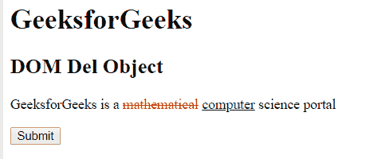
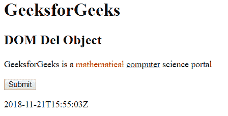
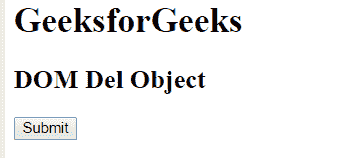
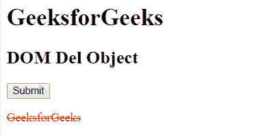

# HTML | DOM Del 对象

> 原文:[https://www.geeksforgeeks.org/html-dom-del-object/](https://www.geeksforgeeks.org/html-dom-del-object/)

HTML DOM 中的 Del 对象用来表示 HTML del 元素。可以通过 getElementById()访问~~元素。
**对象属性:**~~

*   [**cite:**](https://www.geeksforgeeks.org/html-dom-del-cite-property/?ref=rp) 用于设置或返回被删除元素的 cite 属性的值。
*   [**dateTime:**](https://www.geeksforgeeks.org/html-dom-del-datetime-property/?ref=rp) 用于设置或返回已删除元素的 dateTime 属性值。

**语法:**

```html
document.getElementById("ID");
```

其中标识属性是分配给~~标签的标识。
**例 1:**~~

## 超文本标记语言

```html
<!DOCTYPE html>
<html>
    <head>
        <title>HTML DOM Del Object</title>
        <style>
            del {
                color: red;
            }
            ins {
                color: green;
            }
        </style>
    </head>

    <body>
        <h1>GeeksforGeeks</h1>

        <h2>DOM Del Object</h2>

<p>
            GeeksforGeeks is a <del id = "GFG"
            datetime = "2018-11-21T15:55:03Z">
            mathematical</del> <ins>computer</ins>
            science portal
        </p>

        <button onclick="myGeeks()">
            Submit
        </button>

        <p id="sudo"></p>

        <script>
            function myGeeks() {
                var g = document.getElementById("GFG").dateTime;
                document.getElementById("sudo").innerHTML = g;
            }
        </script>

    </body>
</html>                               
```

**输出:**
**之前点击按钮:**



**点击按钮后:**



**示例 2:** 可以使用 document.createElement 方法创建 Del 对象。

## 超文本标记语言

```html
<!DOCTYPE html>
<html>
    <head>
        <title>
            HTML DOM Del Object
        </title>

        <style>
            del {
                color: red;
            }
            ins {
                color: green;
            }
        </style>
    </head>

    <body>
        <h1>GeeksforGeeks</h1>

        <h2>DOM Del Object</h2>

        <button onclick = "myGeeks()">
            Submit
        </button>

        <p id="sudo"></p>

        <script>
            function myGeeks() {
                var g = document.createElement("DEL");
                var f = document.createTextNode("GeeksforGeeks");
                g.appendChild(f);
                document.body.appendChild(g);
            }
        </script>
    </body>
</html>                                   
```

**输出:**
**点击按钮前:**



**点击按钮后:**



**支持的浏览器:***DOM Del Object*支持的浏览器如下:

*   谷歌 Chrome
*   微软公司出品的 web 浏览器
*   火狐浏览器
*   歌剧
*   旅行队