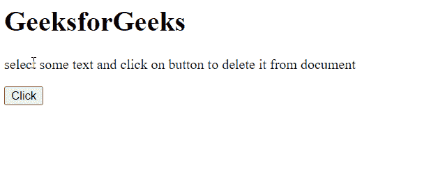

# HTML DOM deleteFromDocument()方法

> 原文:[https://www . geesforgeks . org/html-DOM-delete from document-method/](https://www.geeksforgeeks.org/html-dom-deletefromdocument-method/)

方法**从文档的 DOM 树中删除选定的文本**。

**语法:**

```html
selectedText.deleteFromDocument()
```

**参数:**

*   没有参数

**示例:**

该示例通过单击按钮删除选定的文本。点击按钮后， **Window.getSelection()** 方法获取选中的文本，并借助 **deleteFromDocument()** 方法将其删除。

**示例:**

```html
<html>
   <head>
      <title>GeeksforGeeks</title>
      </head>
      <body>
          <h1>GeeksforGeeks</h1>
        <p>select some text and click on
 button to delete it from document</p>
        <button>Click</button>
      </body>
      <script>
          let btn = document.querySelector('button');
          btn.addEventListener('click', del);

          function del() {
            let sel = window.getSelection();
            sel.deleteFromDocument();
          }
      </script>   
</html>
```

**输出:**

选择一些文本，然后单击按钮将其从文档中删除。



**支持的浏览器:**

*   谷歌 Chrome
*   边缘
*   火狐浏览器
*   歌剧
*   旅行队