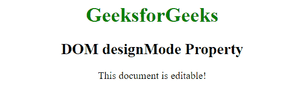
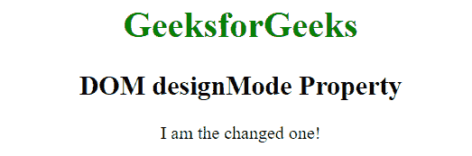
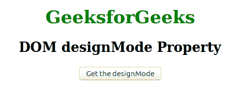
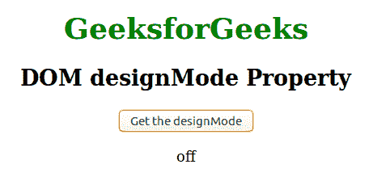

# HTML | DOM 设计模式属性

> 原文:[https://www.geeksforgeeks.org/html-dom-designmode-property/](https://www.geeksforgeeks.org/html-dom-designmode-property/)

HTML 中的 **DOM designMode 属性**用于指定文档是否可编辑。它也可以用来设置文档的可编辑性。

**语法:**

*   **设置:**该属性用于设置文档是否可编辑。

    ```html
    document.designMode = "on|off";
    ```

*   **获取:**该属性用于返回文档是否可编辑。

    ```html
    document.designMode
    ```

**属性值:**该属性包含以下两个值:

*   **关:**为默认值。在此模式下，文档不可编辑。
*   **on:** 在此模式下，文档是可编辑的。

**例 1:**

```html
<!DOCTYPE html>
<html>
    <head>
        <title>
            DOM designMode Property
        </title>
    </head>

    <body style = "text-align: center; ">

        <h1 style = "color: green">
            GeeksforGeeks
        </h1>

        <h2>DOM designMode Property</h2>
        <p>This document is editable!</p>

        <!-- script to set designMode property 
        editable -->
        <script>
            document.designMode = "on";
        </script>
    </body>
</html>                    
```

**输出:**
**编辑段落前:**


**编辑完段落后:**


**例 2:**

```html
<!DOCTYPE html>
<html>
    <head>
        <title>
            DOM designMode Property
        </title>
    </head>

    <body style = "text-align: center;">

        <h1 style = "color: green">
            GeeksforGeeks
        </h1>

        <h2>DOM designMode Property</h2>

        <button onclick="myFunction()">
            Get the designMode
        </button>

        <p id = "geeks"></p>

        <!-- script to display designMode -->
        <script>
            function myFunction() {
                var x = document.designMode;
                document.getElementById("geeks").innerHTML = x;
            }
        </script>
    </body>
</html>                    
```

**输出:**
**之前点击按钮:**


**点击按钮后:**


**支持的浏览器:**下面列出了*设计模式*方法支持的浏览器:

*   谷歌 Chrome
*   微软公司出品的 web 浏览器
*   火狐浏览器
*   歌剧
*   旅行队