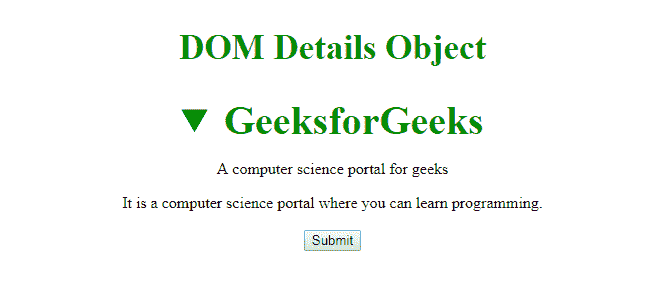

# HTML | DOM 细节对象

> 原文:[https://www.geeksforgeeks.org/html-dom-details-object/](https://www.geeksforgeeks.org/html-dom-details-object/)

**DOM 细节对象**用于表示 HTML [<细节>](https://www.geeksforgeeks.org/html5-details-tag/) 元素。细节元素由**获取元素 ById()** 访问。

**属性:**

*   **打开:**细节标签有一个名为‘打开’的属性，默认用于显示隐藏信息。

**语法:**

```html
document.getElementById("ID");

```

其中“id”是分配给**“详细信息”**标签的 ID。

**示例-1:**

## 超文本标记语言

```html
<!DOCTYPE html>
<html>

<head>
    <title>DOM details Object</title>
    <style>
        h2 {
            color: green;
            font-size: 35px;
        }

        summary {
            font-size: 40px;
            color: #090;
            font-weight: bold;
        }
    </style>
</head>

<body>
    <center>
        <h2>DOM Details Object </h2>

        <!-- assigning id to details tag. -->
        <details id="GFG">
            <summary>GeeksforGeeks</summary>

<p>A computer science portal for geeks</p>

            <div>It is a computer science portal
                 where you can learn programming.</div>
        </details>

        <br>
        <button onclick="myGeeks()">Submit</button>
        <script>
            function myGeeks() {
                // Accessing details tag.
                var x = document.getElementById("GFG");

                // Display hidden information
                // using open property.
                x.open = true;
            }
        </script>
    </center>
</body>

</html>              
```

**输出:**
**点击按钮前:**


**点击 n 按钮后:**



**示例-2:** 可以使用**文档.创建元素**方法创建细节对象。

## 超文本标记语言

```html
<!DOCTYPE html>
<html>

<head>
    <title>details tag</title>
    <style>
        h1,
        h2 {
            text-align: center;
        }

        h1 {
            color: green;
        }

        button {
            margin-left: 40%;
        }

        details {
            font-size: 30px;
            color: green;
            text-align: center;
            margin-top: 30px;
        }
    </style>
</head>

<body>
    <h1>GeeksforGeeks</h1>
    <h2>DOM Details Object</h2>
    <button onclick="myGeeks()">Submit</button>

    <script>
        function myGeeks() {
            var g = document.createElement("DETAILS");
            g.setAttribute("id", "GFG");
            document.body.appendChild(g);

            var f = document.createElement("SUMMARY");
            var text = document.createTextNode("GeeksForGeeks");
            f.appendChild(text);

            document.getElementById("GFG").appendChild(f);

            var z = document.createElement("p");
            var text2 = document.createTextNode(
              "A Computer Science PortaL For Geeks");
            z.appendChild(text2);
            document.getElementById("GFG").appendChild(z);
        }
    </script>
</body>

</html>
```

**输出:**
**点击按钮前:**


**点击按钮后:**


**支持的浏览器:****DOM Details 对象**支持的浏览器如下:

*   谷歌 Chrome
*   微软公司出品的 web 浏览器
*   火狐浏览器
*   歌剧
*   旅行队