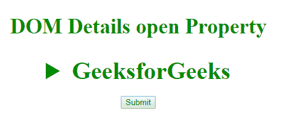
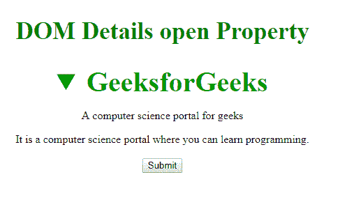
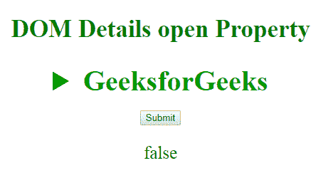

# HTML | DOM 详细信息打开属性

> 原文:[https://www . geesforgeks . org/html-DOM-details-open-property/](https://www.geeksforgeeks.org/html-dom-details-open-property/)

HTML DOM 中的 **Details open 属性**用于设置或返回隐藏信息对用户是否可见。此属性用于反映 HTML 开放属性。

**语法:**

*   它返回详细信息打开属性。

    ```html
    detailsObject.open
    ```

*   它用于设置详细信息打开属性。

    ```html
    detailsObject.open = true|false
    ```

**属性值:**它接受下面列出的两个属性值:

*   **true:** 指定隐藏信息应该可见。
*   **false:** 指定隐藏信息不应该可见。

**返回值:**返回一个布尔值，表示隐藏信息是否可见。

**示例 1:** 本示例返回详细信息打开属性。

```html
<!DOCTYPE html> 
<html> 

<head> 
    <title>
        DOM details open Property
    </title>

    <style> 
        h2 { 
            color: green; 
            font-size: 35px; 
        } 
        summary { 
            font-size: 40px; 
            color: #090; 
            font-weight: bold; 
        } 
    </style> 
</head> 

<body> 
    <center> 
        <h2>DOM Details open Property </h2> 

        <!-- assigning id to details tag. -->
        <details id="GFG"> 
            <summary>GeeksforGeeks</summary> 
            <p>A computer science portal for geeks</p> 
            <div>
                It is a computer science portal 
                where you can learn programming.
            </div> 
        </details> 

        <br> 
        <button onclick="myGeeks()">Submit</button> 

        <script> 
            function myGeeks() { 

                // Accessing details tag. 
                var x = document.getElementById("GFG"); 

                // Display hidden information 
                // using open property. 
                x.open = true; 
            } 
        </script> 
    </center> 
</body> 

</html>                    
```

**输出:**
**点击按钮前:**

**点击按钮后:**


**示例 2:** 本示例设置详细信息打开属性。

```html
<!DOCTYPE html> 
<html> 

<head> 
    <title>DOM details open Property</title> 
    <style> 
        h2 { 
            color: green; 
            font-size: 35px; 
        } 

        summary { 
            font-size: 40px; 
            color: #090; 
            font-weight: bold; 
        } 
    </style> 
</head> 

<body> 
    <center> 
        <h2>DOM Details open Property </h2> 

        <!-- assigning id to details tag. -->
        <details id="GFG"> 
            <summary>GeeksforGeeks</summary> 
            <p>A computer science portal for geeks</p> 
            <div>It is a computer science portal 
                where you can learn programming.</div> 
        </details> 

        <br> 
        <button onclick="myGeeks()">Submit</button> 

        <p id="sudo" style="font-size:25px;"></p>
        <script> 
            function myGeeks() { 
                // Accessing details tag. 
                var x = document.getElementById("GFG"); 

                // Display hidden information 
                // using open property. 
            var g = x.open = false;
                document.getElementById("sudo").innerHTML = g;
            } 
        </script> 
    </center> 
</body> 

</html>             
```

**输出:**
**点击按钮前:**

**点击按钮后:**


**支持的浏览器:****DOM Details 开放属性**支持的浏览器如下:

*   谷歌 Chrome
*   Internet Explorer 10.0 +
*   火狐浏览器
*   歌剧
*   旅行队