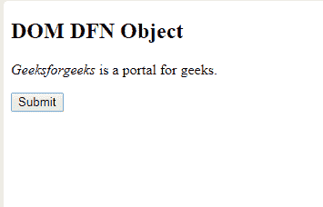
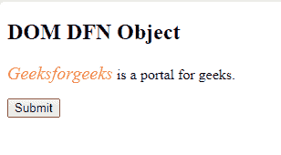
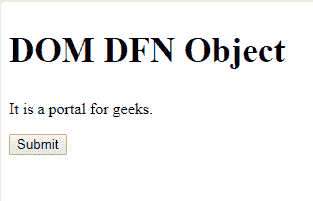
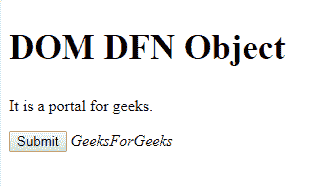

# HTML | DOM DFN 对象

> 原文:[https://www.geeksforgeeks.org/html-dom-dfn-object/](https://www.geeksforgeeks.org/html-dom-dfn-object/)

**DOM DFN 对象**用于表示 [HTML < dfn >标签](https://www.geeksforgeeks.org/html-dfn-tag/)。DFN 元素由 getElementById()访问。

**语法:**

```html
document.getElementById("ID");
```

其中“id”是分配给**“dfn”**标签的 ID。

**示例-1:**

```html
<!DOCTYPE html>
<html>

<head>
    <title>DOM DFN Object</title>
</head>

<body>
    <H2>DOM DFN Object</H2>
    <p>
       <!-- Id assigned to the dfn tag. -->
       <dfn id="GFG">Geeksforgeeks
      </dfn> is a portal for geeks.
    </p>
    <button onclick="myGeeks()">Submit</button>
    <script>
        function myGeeks() {
            <!-- accessing dfn -->
            var gfg = document.getElementById("GFG");
            gfg.style.color = "coral";
            gfg.style.fontSize = "20px";
        }
    </script>
</body>

</html>           
```

**输出:**

**点击按钮前:**


**点击按钮后:**


**示例-2:** 可以使用**文档.创建元素**方法创建 DFN 对象。

```html
<!DOCTYPE html>
<html>

<head>
    <title>DOM DFN Object</title>
</head>

<body>
    <H2 style="font-size:35px;">
      DOM DFN Object
    </H2>

    <p>It is a portal for geeks.</p>
    <button onclick="myGeeks()">
      Submit
    </button>

    <script>
        function myGeeks() {
            var gfg = document.createElement("DFN");
            var f = document.createTextNode("GeeksForGeeks");
            gfg.appendChild(f);
            document.body.appendChild(gfg);
        }
    </script>
</body>

</html>
```

**输出:**

**点击按钮前:**


**点击按钮后:**


**支持的浏览器:**下面列出了 **DOM DFN 对象**支持的浏览器。

*   谷歌 Chrome
*   微软公司出品的 web 浏览器
*   火狐浏览器
*   歌剧
*   旅行队